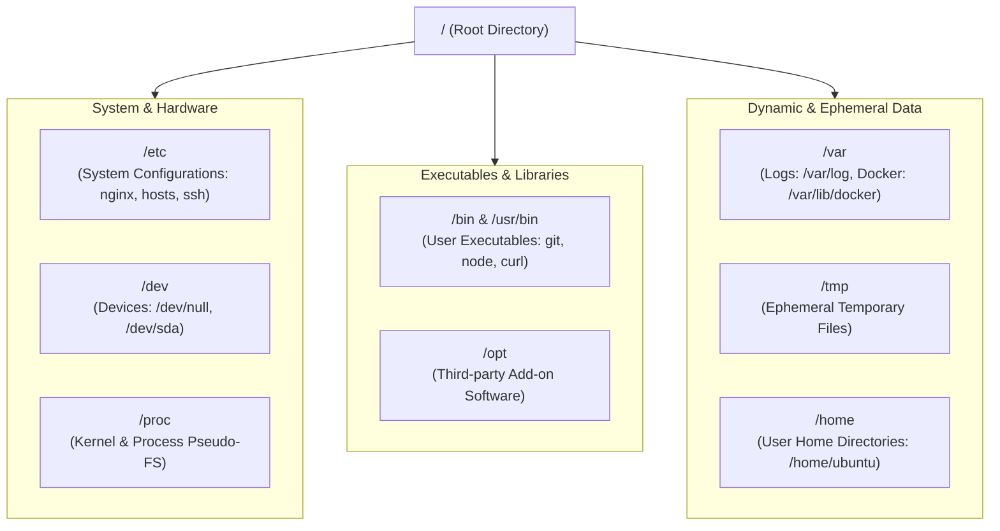

# Manipulating the Linux Filesystem

DevOps တွင် လုပ်ငန်းတာဝန်တိုင်းလိုလိုသည် filesystem နှင့် သက်ဆိုင်နေပါသည်။ Docker configuration ဖိုင်များကို ဖတ်ရှုခြင်း၊ volumes များကို mount ချခြင်း၊ live web server log များကို streaming လုပ်ခြင်း၊ file tree များကို စီမံခန့်ခွဲခြင်းနှင့် build artifact များ သင့်လျော်သော directory များဆီ ရောက်ရှိသွားစေရန် လုပ်ဆောင်ခြင်းတို့ ပါဝင်သည်။



---

## 1. The Filesystem Hierarchy Standard (FHS) အသေးစိတ်

Standard directory တည်နေရာများကို နားလည်ထားခြင်းဖြင့် Linux distribution မည်သည့်အမျိုးအစားတွင်မဆို configuration ဖိုင်များနှင့် diagnostic log များကို ချက်ချင်းရှာဖွေနိုင်မည် ဖြစ်သည်:

| Directory | DevOps & Cloud Engineering တွင် အသုံးပြုပုံ | အဓိက ဖိုင်များနှင့် Subdirectories များ |
| :--- | :--- | :--- |
| **`/etc`** | static system နှင့် service configuration အားလုံးအတွက် ဗဟိုဌာန။ | `/etc/nginx/nginx.conf`, `/etc/hosts`, `/etc/ssh/sshd_config`, `/etc/resolv.conf` |
| **`/var/log`** | system daemon များနှင့် server များ log ဖိုင်များ ရေးသားသည့် standard နေရာ။ | `/var/log/syslog`, `/var/log/nginx/access.log`, `/var/log/auth.log` |
| **`/var/lib`** | local service များအတွက် State နှင့် persistent data များအပြင် container runtime များအတွက် နေရာ။ | `/var/lib/docker` (Docker layers & volumes), `/var/lib/postgresql/data` |
| **`/proc`** | live Linux kernel နှင့် process စာရင်းအချက်အလက်များကို ထုတ်ပြပေးသော virtual pseudo-filesystem။ | `/proc/cpuinfo`, `/proc/meminfo`, `/proc/<PID>/cmdline` |
| **`/dev`** | ရုပ်ပိုင်းဆိုင်ရာနှင့် virtual hardware interface များကို ကိုယ်စားပြုသည့် အထူး device node များ။ | `/dev/null` (the bit bucket), `/dev/zero`, `/dev/urandom` (cryptographic random data) |
| **`/tmp`** | ခဏတာသာသုံးသည့် scratch directory ဖြစ်ပြီး၊ system reboot လုပ်သည့်အခါ အလိုအလျောက် ပျက်သွားမည်။ | Temporary build artifacts, socket files, PID locks |
| **`/usr/local/bin`** | administrator များ ထည့်သွင်းထားသော custom binary နှင့် command-line tool များ။ | Manual ဖြင့် download ဆွဲထားသော `kubectl`, `helm`, `terraform` သို့မဟုတ် `docker-compose` binary များ |

---

## 2. Absolute vs. Relative Paths

```text
Absolute Path:   /var/log/nginx/access.log   (Always starts with leading / root)
Relative Path:   ./nginx/access.log          (Relative to current location)
Parent Path:     ../logs/access.log          (Step up one folder, then enter logs)
Home Path:       ~/projects/api              (Expands to /home/username/projects/api)
```

<Callout type="important" title="Always Use Absolute Paths in CI/CD and Cron Jobs">
Automated script များ (ဥပမာ- GitHub Actions, Dockerfiles သို့မဟုတ် crontabs) တွင် working directory သည် ပြောင်းလဲနိုင်ပါသည်။ path-resolution အမှားအယွင်းများ မဖြစ်စေရန် relative path (`./start.sh`) များအစား တိကျသော **absolute path** များကိုသာ (ဥပမာ `/opt/app/start.sh`) အမြဲသုံးပါ။
</Callout>

---

## 3. Brace Expansion ဖြင့် ဖိုင်များနှင့် Directory များ ဖန်တီးခြင်း

```bash
# 1. ဖိုင်အလွတ်တစ်ခု ဖန်တီးခြင်း (သို့မဟုတ် ရှိပြီးသားဖိုင်၏ timestamp ကို update လုပ်ခြင်း)
touch app.config

# 2. ဖိုင်များစွာကို တစ်ပြိုင်နက် ဖန်တီးခြင်း
touch Dockerfile docker-compose.yml .env.example

# 3. Directory အထပ်ထပ် (nested) များကို command တစ်ခုတည်းဖြင့် ဖန်တီးခြင်း (-p flag)
mkdir -p deployments/production/k3s/manifests

# 4. Bash Brace Expansion ({...}) ဖြင့် ဖန်တီးမှုကို အရှိန်မြှင့်ခြင်း
# ဖန်တီးပေးမည့်အရာများ: src/, tests/, docs/, နှင့် config/ တို့ကို အဆင့်တစ်ခုတည်းဖြင့်
mkdir -p app/{src,tests,docs,config}

# Test data ဖိုင် 5 ခု ဖန်တီးရန်: test-1.log, test-2.log, ..., test-5.log
touch app/tests/test-{1..5}.log
```

---

## 4. ဖိုင်များကို လုံခြုံစွာ ကူးယူခြင်းနှင့် ရွှေ့ပြောင်းခြင်း

```bash
# ဖိုင်တစ်ခုတည်းကို ကူးယူခြင်း
cp app.config app.config.bak

# Directory တစ်ခုလုံးကို RECURSIVELY ကူးယူခြင်း (directory များအတွက် -r flag လိုအပ်သည်)
cp -r src/ src.backup/

# Permissions, timestamps, နှင့် ownership များကိုပါ ထိန်းသိမ်းပြီး ကူးယူခြင်း (-a Archive mode)
# deployment script များတွင် executable bit များ မပျောက်သွားစေရန် အလွန်အရေးကြီးသည်!
cp -a /var/www/html /var/www/html.backup

# ဖိုင်တစ်ခုကို directory အသစ်တစ်ခုသို့ ရွှေ့ခြင်း (relocate)
mv Dockerfile deployments/production/

# ရှိပြီးသားနေရာမှာပင် ဖိုင်အမည်ပြောင်းခြင်း
mv old-config.yaml new-config.yaml
```

---

## 5. ဖိုင်ကြည့်ရှုခြင်းနှင့် Diagnostic Tool များ

GUI editor မပါရှိသည့် headless production ပတ်ဝန်းကျင်များတွင် command-line inspection tool များကို အသုံးပြုရန် အလွန်အရေးကြီးပါသည်:

### `cat` — ဖိုင်တိုများကို အမြန်ကြည့်ရှုခြင်း
```bash
# ဖိုင်ပါ အကြောင်းအရာများကို terminal တွင် ပုံနှိပ်ပြရန်
cat /etc/os-release

# လိုင်းနံပါတ်များပါ ထည့်သွင်း ပုံနှိပ်ရန် (-n flag)
cat -n package.json
```

### `less` — ဖိုင်ကြီးများအတွက် Interactive Pager
500MB ရှိသော log ဖိုင်ကြီးတစ်ခုပေါ်တွင် `cat` ကို ဘယ်တော့မှ မသုံးပါနှင့်! Terminal memory ကို ဝန်မပိစေဘဲ စာမျက်နှာဆင်းရန်နှင့် ရှာဖွေရန် `less` ကိုသုံးပါ:

```bash
less /var/log/syslog
```

**အဓိကကျသော `less` Navigation Key များ**:
- <kbd>Space</kbd> / <kbd>f</kbd> — တစ်မျက်နှာ အောက်သို့ ဆင်းရန်။
- <kbd>b</kbd> — တစ်မျက်နှာ အပေါ်သို့ တက်ရန်။
- <kbd>G</kbd> — ဖိုင်၏ **အနောက်ဆုံး** သို့ ခုန်သွားရန်။
- <kbd>g</kbd> — ဖိုင်၏ **အစဆုံး** သို့ ခုန်သွားရန်။
- <kbd>/</kbd>`keyword` — စာသားကို ရှေ့သို့ ရှာဖွေရန်။
- <kbd>n</kbd> — ရှာတွေ့ထားသည့် **နောက်တစ်နေရာ** သို့ ခုန်သွားရန်။
- <kbd>N</kbd> — ရှာတွေ့ထားသည့် **ယခင်တစ်နေရာ** သို့ ခုန်သွားရန်။
- <kbd>q</kbd> — **ထွက်ရန်** နှင့် shell prompt သို့ ပြန်သွားရန်။

### `head` နှင့် `tail` — ဖိုင်၏ အစနှင့် အဆုံးပိုင်းများ
```bash
# ဖိုင်တစ်ခု၏ ပထမဆုံး လိုင်း ၁၅ လိုင်းကို ကြည့်ရန်
head -n 15 /etc/passwd

# log ဖိုင်တစ်ခု၏ နောက်ဆုံး လိုင်း ၂၀ ကို ကြည့်ရန်
tail -n 20 /var/log/nginx/access.log
```

### `tail -f` နှင့် `tail -F` — Live Log Streaming

```bash
# ဝင်လာမည့် log အသစ်များကို real time ဖြင့် တိုက်ရိုက်ကြည့်ရှုရန် (follow mode)
tail -f /var/log/nginx/access.log

# tail -F (capital F) — log ဖိုင်ကို rotate လုပ်လိုက်လျှင်တောင် (ဥပမာ logrotate) ဆက်လက်ဖမ်းယူပြီး ကြည့်ရန်
tail -F /var/log/app.log
```

<Callout type="tip" title="DevOps Pro Command: Real-Time Polling with watch">
Command တစ်ခုကို အချိန်အလိုက် ပုံမှန် Run ပြီး screen ပြည့် output ပြောင်းလဲမှုများကို ကြည့်ရန် `watch` ကို သုံးပါ:
```bash
# disk space သို့မဟုတ် directory ကြီးထွားလာမှုကို ၂ စက္ကန့်တစ်ကြိမ် စောင့်ကြည့်ရန်
watch -n 2 df -h
watch -n 1 ls -lh /var/log/nginx/
```
</Callout>

---

## 6. ဖယ်ရှားခြင်းဆိုင်ရာ လုံခြုံရေးနှင့် Best Practice များ

```bash
# ဖိုင်တစ်ခုတည်းကို ဖျက်ရန်
rm old-config.yaml

# အလွတ်ဖြစ်နေသော directory ကို ဖျက်ရန်
rmdir empty-dir

# directory နှင့် ၎င်းထဲပါ အရာအားလုံးကို recursive (-r) ဖြင့် အတည်ပြုချက်မတောင်းဘဲ (-f) ဖျက်ရန်
rm -rf temporary-build/
```

<Callout type="danger" title="The rm -rf Danger Zone">
Linux command line တွင် **Recycle Bin သို့မဟုတ် Trash folder မရှိပါ။** ဖိုင်တစ်ခုကို `rm` ဖြင့် ဖျက်လိုက်သည်နှင့် ၎င်း၏ inode များကို ဖြတ်တောက်လိုက်ပြီး data block များကို overwrite လုပ်ရန် ချက်ချင်း အသင့်ဖြစ်သွားစေသည်။

**Best Practice ဖြစ်သော လုံခြုံရေး အလေ့အထများ**:
1. `pwd` ကို အရင်မစစ်ဆေးဘဲ directory တစ်ခုခုအတွင်း `rm -rf *` ကို ဘယ်တော့မှ မလုပ်ပါနှင့်။
2. အတည်မပြုရသေးဘဲ deletion command များထဲတွင် shell variable များကို မသုံးပါနှင့် (ဥပမာ `$DIR` သည် အလွတ်ဖြစ်နေပါက `rm -rf /$DIR` သည် `rm -rf /` ဖြစ်သွားလိမ့်မည်!)။
3. `rm *.bak` မလုပ်မီ target glob ကို အရင်အတည်ပြုရန် `ls` ဖြင့် အရင် Dry-run လုပ်ပါ: `ls *.bak`။
</Callout>

---

## Summary

- **Filesystem Hierarchy Standard (FHS)** သည် system config များကို `/etc` တွင်လည်းကောင်း၊ log များကို `/var/log` တွင်လည်းကောင်း၊ device node များကို `/dev` တွင်လည်းကောင်း စနစ်တကျ စီစဉ်ပေးထားသည်။
- working directory ရှုပ်ထွေးမှုများကို ရှောင်ရှားရန် automation pipeline များတွင် **absolute path** များကို အမြဲသုံးပါ။
- directory များကို အမြန်ဆောက်လုပ်ရန် **brace expansion** (`mkdir -p app/{src,dist,config}`) ကို သုံးပါ။
- ဖိုင်၏ timestamp၊ permission နှင့် symlink များကို ထိန်းသိမ်းထားရန် `cp -a` (archive mode) ကို သုံးပါ။
- ဖိုင်ကြီးများအတွက် `less` ကိုလည်းကောင်း၊ live rotating log များအတွက် `tail -F` ကိုလည်းကောင်း၊ command များကို အဆက်မပြတ် စောင့်ကြည့်ရန် `watch` ကိုလည်းကောင်း သုံးပါ။

နောက်သင်ခန်းစာတွင် terminal ထဲတွင် စာသားများ တည်းဖြတ်ခြင်း (`nano`, `vim`)၊ `grep` နှင့် `find` တို့ဖြင့် ရှာဖွေခြင်း၊ နှင့် `sed` & `awk` တို့ဖြင့် stream transformation ပြုလုပ်ခြင်းတို့ကို ကျွမ်းကျင်အောင် သင်ယူရမည် ဖြစ်ပါသည်။