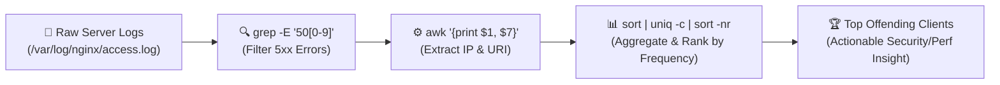
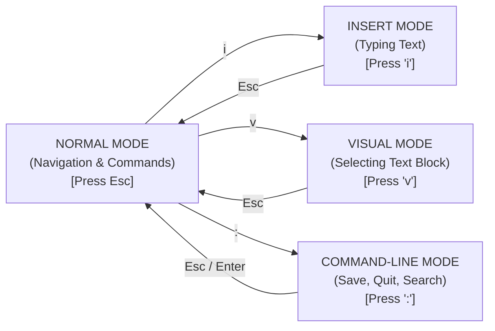

# Searching, Filtering & Editing Text in Linux

Cloud infrastructure နဲ့ DevOps တွေမှာ configuration files တွေ (YAML, JSON, INI, Nginx configs) နဲ့ server logs တွေဟာ plain text တွေပဲ ဖြစ်ပါတယ်။ Remote shell ထဲမှာ ဖိုင်တွေကို တိုက်ရိုက် edit လုပ်နိုင်ဖို့၊ ပြီးတော့ `grep`၊ `find`၊ `sed` နဲ့ `awk` တို့ကိုသုံးပြီး gigabytes နဲ့ချီတဲ့ log output တွေကို parse လုပ်နိုင်ဖို့ဆိုတာ မရှိမဖြစ် လိုအပ်တဲ့ engineering skill တစ်ခု ဖြစ်ပါတယ်။



---

## 1. Terminal Text Editors: `nano` vs. `vim`

Remote Linux server တစ်ခုကို SSH ဝင်လိုက်တဲ့အခါ ဒါမှမဟုတ် Container တစ်ခုထဲ ရောက်သွားတဲ့အခါ VS Code GUI ဆိုတာ မရှိပါဘူး။ Terminal-based editor တစ်ခုခုကို မဖြစ်မနေ သုံးရပါမယ်။

### `nano` — အစပြုသူတွေအတွက် သုံးရလွယ်ကူတဲ့ Editor
`nano` က သုံးရတာ ရှင်းလလင်းနဲ့ လွယ်ကူပြီး မျက်နှာပြင်အောက်ခြေမှာ keyboard shortcuts တွေကို ပြပေးထားပါတယ် (`^` က <kbd>Ctrl</kbd> key ကို ကိုယ်စားပြုပါတယ်):

```bash
nano /etc/nginx/nginx.conf
```
- <kbd>Ctrl + O</kbd> — ပြောင်းလဲမှုများကို **WriteOut (Save)** လုပ်ရန်။ ဖိုင်နာမည်အတည်ပြုရန် <kbd>Enter</kbd> ကို နှိပ်ပါ။
- <kbd>Ctrl + W</kbd> — စာသားများကို **Where Is (Search)** ရှာရန်။
- <kbd>Ctrl + K</kbd> — လိုင်းတစ်လိုင်းလုံးကို **Cut** လုပ်ရန်။
- <kbd>Ctrl + U</kbd> — **Paste (Uncut)** လုပ်ရန်။
- <kbd>Ctrl + X</kbd> — nano မှ **Exit** ထွက်ရန် (modify လုပ်ထားတာရှိရင် save မလုပ်ရသေးကြောင်း မေးပါလိမ့်မယ်)။

---

### `vim` — နေရာတိုင်းမှာသုံးလို့ရပြီး စွမ်းဆောင်ရည်မြင့်မားတဲ့ Editor
`vim` (Vi IMproved) ကို Linux distribution တိုင်းနဲ့ container base image တိုင်းလိုလိုမှာ ကြိုတင် install လုပ်ပြီးသား တွေ့ရပါတယ်။ ဒါက **modal editor** တစ်ခု ဖြစ်ပါတယ်:



### မရှိမဖြစ် သိထားရမယ့် `vim` Cheat Sheet:

1. **ဖိုင်တစ်ခုဖွင့်ရန်**: `vim app.config` (**Normal Mode** နဲ့ စတင်ပါတယ်။)
2. **စာစတင်ရိုက်ရန်**: <kbd>i</kbd> ကိုနှိပ်ပြီး **Insert Mode** ကိုပြောင်းပါ။
3. **စာရိုက်တာရပ်ပြီး command mode ကို ပြန်သွားရန်**: <kbd>Esc</kbd> ကို နှိပ်ပါ။
4. **Save လုပ်ပြီး ထွက်ရန်**:
   - `:w` — Save (Write) လုပ်ရန်။
   - `:q` — Quit ထွက်ရန်။
   - `:wq` ဒါမှမဟုတ် `ZZ` — **Save လုပ်ပြီး ထွက်ရန်**။
   - `:q!` — **Save မလုပ်ဘဲ အတင်းထွက်ရန် (မသိမ်းရသေးတဲ့ ပြောင်းလဲမှုတွေအားလုံး ပျက်သွားပါမယ်)**။
5. **Normal Mode ထဲတွင် သွားလာခြင်းနှင့် Edit လုပ်ခြင်း**:
   - `dd` — လက်ရှိလိုင်းကို ဖျက်ရန် (cut လုပ်ရန်)။
   - `yy` — လက်ရှိလိုင်းကို ကူးယူရန် (yank လုပ်ရန်)။
   - `p` — Cursor ရဲ့ အောက်မှာ Paste လုပ်ရန်။
   - `u` — နောက်ဆုံးလုပ်ခဲ့တဲ့ ပြောင်းလဲမှုကို **Undo** လုပ်ရန်။
   - `Ctrl + r` — Undo လုပ်ထားတာကို **Redo** ပြန်လုပ်ရန်။
   - `/keyword` — ရှေ့ကို `keyword` လိုက်ရှာရန် (`n` ကိုနှိပ်ရင် နောက်ထပ် တူတာတွေကို ဆက်ရှာပေးပါတယ်)။
   - `:%s/old/new/g` — ဖိုင်တစ်ခုလုံးမှာ ရှိတဲ့ စာသားဟောင်းတွေကို အသစ်နဲ့ အစားထိုးရန်။
   - `:set number` — လိုင်းနံပါတ်များကို ပြသရန်။

---

## 2. `grep` ဖြင့် ဖိုင်တွင်းပါရှိသော စာသားများကို ရှာဖွေခြင်း

`grep` (Global Regular Expression Print) က ဖိုင်တွေထဲမှာ (ဒါမှမဟုတ် standard input ထဲမှာ) text patterns တွေကို ရှာဖွေပေးပါတယ်:

```bash
# Basic case-sensitive ရှာဖွေခြင်း
grep "ERROR" /var/log/syslog

# Case-insensitive ရှာဖွေခြင်း (-i)
grep -i "database connection failed" app.log

# Recursive directory ရှာဖွေခြင်း (-r) နဲ့ line numbers တွေပါ ထုတ်ပြခြင်း (-n)
grep -rn "API_SECRET_KEY" ./src/

# မတူညီတာတွေကို ရှာခြင်း (-v): မပါဝင်တဲ့ လိုင်းတွေအားလုံးကို ထုတ်ပြပါ
grep -v "^#" /etc/ssh/sshd_config   # comment လိုင်းတွေ (#) ကို ဖြုတ်ပြီး config တွေကို ပြပါ
grep -v "^$" /etc/ssh/sshd_config   # အလွတ်လိုင်းတွေကို ဖြုတ်ပြီး ပြပါ

# Extended Regular Expressions (-E) ကိုသုံးပြီး ရှာဖွေခြင်း
grep -E "(404|500|502)" /var/log/nginx/access.log

# Context lines: ရှေ့လိုင်း (Before -B)၊ နောက်လိုင်း (After -A) ဒါမှမဟုတ် နှစ်ခုလုံး (Both -C) ကိုပါ ထည့်ပြရန်
grep -C 3 "FATAL EXCEPTION" /var/log/app.log

# ကိုက်ညီတဲ့ text ကိုပဲ ထုတ်ပြရန် (-o) နဲ့ တွေ့ရှိတဲ့အကြိမ်ရေကို ရေတွက်ရန် (-c)
grep -c "GET /api/v1/checkout" access.log
```

---

## 3. `find` ဖြင့် ဖိုင်များကို ရှာဖွေခြင်း

`grep` က ဖိုင်တွေ *ထဲမှာ* ရှာတာဖြစ်ပြီး၊ `find` ကတော့ filesystem ထဲမှာ ဖိုင်တွေရဲ့ attribute တွေအလိုက် ရှာဖွေပေးတာ ဖြစ်ပါတယ်:

```bash
# နာမည်အလိုက် ဖိုင်ရှာရန် (case-sensitive)
find /etc -name "nginx.conf"

# ပုံစံတူ နာမည်တွေအလိုက် ရှာရန် (case-insensitive -iname)
find . -iname "*.yaml"

# Directories များကိုသာ (-type d) ဒါမှမဟုတ် Regular Files များကိုသာ (-type f) ရှာရန်
find /var/log -type f -name "*.log"

# လွန်ခဲ့တဲ့ ၂၄ နာရီအတွင်း modify လုပ်ထားတဲ့ဖိုင်များ (-mtime -1) ဒါမှမဟုတ် ၇ ရက်ထက် ပိုဟောင်းတာတွေ (+7) ကို ရှာရန်
find /tmp -type f -mtime +7

# 100MB ထက်ကြီးတဲ့ ဖိုင်များကို ရှာရန် (-size +100M)
find /var -type f -size +100M

# သတ်မှတ်ထားတဲ့ permissions တွေနဲ့ ဖိုင်များကို ရှာရန်
find ~/.ssh -type f -perm 600

# တွေ့ရှိသမျှ ဖိုင်တိုင်းအပေါ် command တစ်ခုကို run ရန် (-exec ... {})
# ရက် ၃၀ ထက်ဟောင်းတဲ့ log တွေကို အလိုအလျောက် compress လုပ်ရန်:
find /var/log/apps -type f -name "*.log" -mtime +30 -exec gzip {} \;

# ယာယီ socket ဖိုင်များကို လုံလုံခြုံခြုံ ဖျက်ရန်
find /tmp -type s -name "*.sock" -delete
```

---

## 4. `sed` ဖြင့် Stream Editing ပြုလုပ်ခြင်း

`sed` (Stream Editor) က editor တစ်ခုကို ဖွင့်စရာမလိုဘဲ text stream တွေကို တိုက်ရိုက် ပြုပြင်ပေးပါတယ်:

```bash
# Output stream ထဲက 'localhost:5432' ကို 'postgres-db:5432' နဲ့ အစားထိုးရန်
sed 's/localhost:5432/postgres-db:5432/g' config.env

# ဖိုင်ထဲမှာ တိုက်ရိုက် modify လုပ်ရန် (-i flag) — disk ပေါ်က ဖိုင်ကို တိုက်ရိုက် update ဖြစ်သွားစေပါတယ်!
sed -i 's/DEBUG=true/DEBUG=false/g' .env

# backup ဖိုင်အလိုအလျောက် ဖန်တီးပြီးမှ တိုက်ရိုက် modify လုပ်ရန်
sed -i.bak 's/PORT=3000/PORT=8080/g' .env

# pattern နဲ့ ကိုက်ညီတဲ့ လိုင်းတွေကို ဖျက်ရန်
sed -i '/^#/d' config.ini       # comment လိုင်းအားလုံးကို ဖျက်ရန်
sed -i '/^$/d' config.ini       # အလွတ်လိုင်းအားလုံးကို ဖျက်ရန်
```

---

## 5. `awk` ဖြင့် Column Extraction & Analysis ပြုလုပ်ခြင်း

`awk` ဆိုတာကတော့ structured column data တွေ (ဥပမာ- CSVs၊ access logs ဒါမှမဟုတ် command output တွေ) နဲ့ အလုပ်လုပ်ဖို့ ဖန်တီးထားတဲ့ pattern-scanning နဲ့ text-processing language တစ်ခု ဖြစ်ပါတယ်။

```bash
# သတ်မှတ်ထားတဲ့ column တွေကို ထုတ်ပြရန် ($1 = ပထမ column၊ $4 = စတုတ္ထ column)
# ဥပမာ- /etc/passwd ထဲက usernames နဲ့ default shells တွေကို ထုတ်ပြရန် (delimiter -F :)
awk -F: '{print $1, $7}' /etc/passwd

# Nginx access log ကို parse လုပ်ပြီး IP ($1) နဲ့ HTTP Status ($9) ကို ထုတ်ယူရန်
awk '{print $1, $9}' /var/log/nginx/access.log

# Conditional filtering: ps aux ထဲက CPU > 10% သုံးနေတဲ့ process များကို ထုတ်ပြရန်
ps aux | awk '$3 > 10.0 {print $2, $3, $11}'
```

---

## 6. Text Manipulation Toolkit: `wc`, `sort`, `uniq`, `cut`, `tr`

```bash
# 1. wc (Word Count): lines (-l), words (-w), bytes (-c)
wc -l /var/log/syslog

# 2. cut: သတ်မှတ်ထားတဲ့ field များကို ထုတ်ယူရန်
# /etc/hosts ထဲက IP addresses များကိုသာ ထုတ်ယူရန်
cut -d' ' -f1 /etc/hosts

# 3. tr: စာသားများကို ပြောင်းလဲရန် သို့မဟုတ် ဖျက်ရန်
# စာသားတွေကို uppercase အဖြစ်ပြောင်းရန်
echo "hello devops" | tr '[:lower:]' '[:upper:]'
# ဖိုင်ထဲက Windows carriage returns (\r) တွေကို ဖျက်ရန်
cat windows.sh | tr -d '\r' > unix.sh

# 4. sort & uniq: ထပ်နေတာတွေကို စစ်ထုတ်ပြီး ရေတွက်ရန်
# လက်တွေ့သုံး DevOps recipe: Web server ကို ဝင်ရောက်လာတဲ့ Top 5 IP addresses များ
awk '{print $1}' /var/log/nginx/access.log | sort | uniq -c | sort -nr | head -n 5
```

---

## Summary

- အမြန်ပြင်ဆင်ဖို့အတွက် **`nano`** ကိုသုံးပါ၊ ကျွမ်းကျင်ဖို့အတွက် **`vim`** (`i` နှိပ်ပြီး insert လုပ်ရန်၊ <kbd>Esc</kbd> + `:wq` နှိပ်ပြီး save လုပ်ရန်၊ `:q!` နှိပ်ပြီး ထွက်ရန်) ကို လေ့လာပါ။
- Codebase တစ်ခုလုံးမှာ keyword တွေနဲ့ regex တွေကို အမြန်ရှာဖို့ **`grep -rnE`** ကိုသုံးပါ။
- နာမည်၊ အရွယ်အစား၊ အမျိုးအစား ဒါမှမဟုတ် သက်တမ်းအလိုက် ဖိုင်တွေကို ရှာဖို့နဲ့ `-exec` သုံးပြီး batch operations တွေလုပ်ဖို့ **`find`** ကိုသုံးပါ။
- CI/CD scripts တွေထဲမှာ configuration တွေကို အလိုအလျောက် အစားထိုးဖို့ **`sed -i`** ကိုသုံးပါ။
- High-speed log-analysis pipeline တွေ တည်ဆောက်ဖို့ **`awk`**၊ **`sort`** နဲ့ **`uniq -c`** တို့ကို တွဲဖက်သုံးပါ။

နောက်သင်ခန်းစာမှာတော့ Linux permissions, ownership, octal modes (`chmod 755/600`) နဲ့ `sudo` သုံးပြီး superuser delegation လုပ်တာတွေကို ဆက်လက် လေ့လာရမှာ ဖြစ်ပါတယ်!