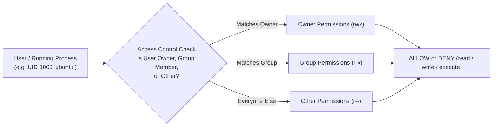
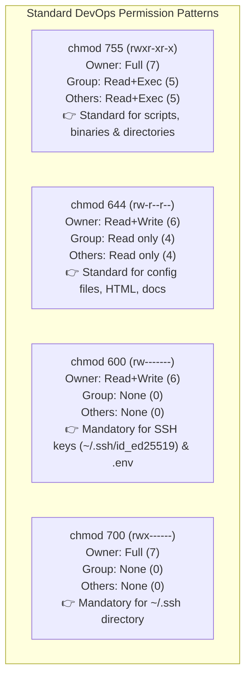

# Linux Security Model: Permissions & Ownership

Linux သည် ဒီဇိုင်းအားဖြင့် multi-user, multi-tenant operating system တစ်ခု ဖြစ်ပါသည်။ Process၊ file နှင့် directory တိုင်းသည် သတ်မှတ်ထားသော **User ID (UID)** နှင့် **Group ID (GID)** တို့နှင့် ချိတ်ဆက်နေကြသည်။ Linux က access control ကို ဘwie ကျင့်သုံးလဲဆိုတာ နားလည်ထားခြင်းဖြင့် CI/CD pipelines တွေမှာ ဖြစ်တတ်တဲ့ `Permission denied`Errors တွေလိုမျိုး ဒါမှမဟုတ် မတော်တဆ permission လျှိုထွက်တာ (`chmod 777`) လို production ပြဿနာတွေကို ကာကွယ်နိုင်ပါတယ်။



---

## 1. Users, Groups & Identity

Linux ပေါ်ရှိ account တိုင်းတွင် ထူးခြားသော နံပါတ်ပါသော identifier တစ်ခုစီ ရှိကြသည်:

| Account Type | Typical UID Range | Examples | Purpose |
| :--- | :--- | :--- | :--- |
| **Superuser (root)** | `0` | `root` | kernel တစ်ခုလုံးတွင် အကန့်အသတ်မရှိ administrative ထိန်းချုပ်နိုင်ခြင်း |
| **System Accounts** | `1` – `999` | `www-data`, `nginx`, `postgres`, `daemon` | အခွင့်အရေးမရှိသော service daemons များ (direct login လုပ်၍မရပါ) |
| **Human / Regular Users** | `1000`+ | `ubuntu`, `alice`, `deploy` | အပြန်အလှန်အသုံးပြုသူများနှင့် DevOps deployment အလုပ်သမားများ |

```bash
# Check current username
whoami
# Output: ubuntu

# Inspect your numerical UID, GID, and all group memberships
id
# Output: uid=1000(ubuntu) gid=1000(ubuntu) groups=1000(ubuntu),4(adm),27(sudo),998(docker)

# View all groups configured on the system
cat /etc/group | cut -d: -f1
```

---

## 2. Deconstructing the 10-Character Permission String

သင်သည် `ls -l` ကို run လိုက်တဲ့အခါ entry တိုင်းသည် 10-character mode string ဖြင့် စတင်ပါတယ်:

```text
-  r w x  r - x  r - -    1  ubuntu  developers   4096  Aug 18 10:00  deploy.sh
┬  ─────  ─────  ─────
│    │      │      │
│    │      │      └──────── Others / World Permissions (Everyone else)
│    │      └─────────────── Group Permissions (Members of 'developers')
│    └────────────────────── Owner / User Permissions (The user 'ubuntu')
└─────────────────────────── File Type (- = Regular File, d = Directory, l = Symlink)
```

### File vs. Directory Permission Semantics

`r`၊ `w` နှင့် `x` permissions တွေသည် files နဲ့ directories တွေအတွက် အဓိပ္ပာယ် လုံးဝကွာခြားပါတယ်:

| Permission | Octal Value | Meaning for a File | Meaning for a Directory |
| :--- | :---: | :--- | :--- |
| **`r` (Read)** | **`4`** | file contents တွေကို ဖွင့်ပြီး ဖတ်ရှုခြင်း (`cat`, `less`) | ဖိုင်တွဲထဲရှိ files များကို စာရင်းထုတ်ကြည့်ခြင်း (`ls`) |
| **`w` (Write)** | **`2`** | file content ကို ပြင်ဆင်ခြင်း၊ သိမ်းဆည်းခြင်း သို့မဟုတ် ဖြတ်တောက်ခြင်း | ဖိုင်တွဲအတွင်း files အသစ်ဖန်တီးခြင်း၊ အမည်ပြောင်းခြင်း သို့မဟုတ် ဖျက်ခြင်း |
| **`x` (Execute)** | **`1`** | file ကို binary program သို့မဟုတ် shell script အဖြစ် run ခြင်း | directory ထဲ ဝင်ရောက်ခြင်း (`cd`) နှင့် file metadata ကို ဝင်သုံးခြင်း |

<Callout type="important" title="Directories ALWAYS Need Execute (+x) Permission!">
Directory တစ်ခုမှာ `x` (execute) bit မရှိရင်, သီးသန့် files တွေမှာ `r` (read) permissions ရှိနေရင်တောင်မှ အသုံးပြုသူတွေဟာ အဲ့ဒီထဲကို `cd` လုပ်ပြီး ဝင်လို့မရသလို အထဲက files တွေကိုလည်း ဝင်သုံးလို့မရပါဘူး!
</Callout>

---

## 3. The Octal Mode Calculation

Permissions များကို octal digits သုံးခုဖြင့် ကိုယ်စားပြုပါတယ် (Owner၊ Group နှင့် Others အတွက် တစ်ခုစီ)။ digit တစ်ခုချင်းစီသည် ၎င်း၏ permission values တွေရဲ့ ပေါင်းလဒ် ဖြစ်ပါတယ် (`r=4`, `w=2`, `x=1`):

```text
r w x   =   4 + 2 + 1   =   7   (Full access)
r w -   =   4 + 2 + 0   =   6   (Read + Write)
r - x   =   4 + 0 + 1   =   5   (Read + Execute)
r - -   =   4 + 0 + 0   =   4   (Read only)
- - -   =   0 + 0 + 0   =   0   (No access)
```



---

## 4. Modifying Permissions with `chmod`

### Numeric Mode (Fast & Explicit)
```bash
# Make a deployment script executable for everyone, writable only by owner
chmod 755 deploy.sh

# Restrict sensitive environment secrets to owner only
chmod 600 .env.production

# Restrict SSH directory
chmod 700 ~/.ssh
```

### Symbolic Mode (Targeted Add/Remove)
သင်္ကေတများကို အသုံးပြုပါ: Users (`u`), Groups (`g`), Others (`o`), All (`a`), operators များနှင့်အတူ `+` (ထည့်ရန်), `-` (ဖယ်ရှားရန်), `=` (အတိအကျ သတ်မှတ်ရန်):

```bash
# Add execute permission for user/owner (+x)
chmod u+x build.sh

# Make executable for all users (shorthand for a+x)
chmod +x build.sh

# Remove write permission from group and others (go-w)
chmod go-w application.config

# Set exact permissions: user gets read/write, group gets read, others get none
chmod u=rw,g=r,o= secrets.txt
```

---

## 5. Special Permission Bits: SUID, SGID & Sticky Bit

အခြေခံ `rwx` အပြင် Linux သည် advanced access control အတွက် special permission bits သုံးခုကို ပံ့ပိုးပေးပါတယ်:

| Special Bit | Octal Value | Symbol in `ls -l` | Practical Purpose | Real-World Example |
| :--- | :---: | :---: | :--- | :--- |
| **SUID (Set User ID)** | **`4000`** | owner ထဲရှိ `s` (`rwsr-xr-x`) | Executable သည် ခေါ်ဆိုအသုံးပြုသူမဟုတ်ဘဲ **file owner** ၏ အခွင့်အရေးများနှင့် run ပါတယ်။ | `/usr/bin/passwd` (සාමාන්‍ newUser များကို `/etc/shadow` ကို update လုပ်ခွင့်ပြုသည်) |
| **SGID (Set Group ID)** | **`2000`** | group ထဲရှိ `s` (`rwxr-sr-x`) | directory ထဲမှာ ဖန်တီးလိုက်တဲ့ files အသစ်တွေဟာ **parent directory's group** ကို အလိုအလျောက် ဆက်ခံပါတယ်။ | Shared team collaboration folders (`/var/www/shared`) |
| **Sticky Bit** | **`1000`** | others ထဲရှိ `t` (`rwxrwxrwt`) | world-writable directory တစ်ခုထဲမှာတောင်မှ **သူတို့ကိုယ်တိုင်ပိုင်ဆိုင်တဲ့** files တွေကိုသာ အသုံးပြုသူတွေက ဖျက်နိုင် သို့မဟုတ် အမည်ပြောင်းနိုင်ပါတယ်။ | `/tmp` နှင့် `/var/tmp` |

```bash
# Enable Sticky Bit on shared directory (1777)
chmod 1777 /tmp/shared-data

# Enable SGID on shared team directory so all new files belong to 'developers' group (2775)
chmod 2775 /var/www/project
```

---

## 6. Changing File Ownership with `chown` & `chgrp`

```bash
# Change owner to user 'node'
chown node app.js

# Change BOTH owner and group simultaneously (user:group syntax)
chown ubuntu:docker /var/run/docker.sock

# Change ownership recursively across an entire directory tree (-R flag)
chown -R www-data:www-data /var/www/html/

# Change group only
chgrp developers /opt/shared-scripts/
```

---

## 7. Default File Creation Mask: `umask`

application တစ်ခုက file အသစ်တစ်ခု ဖန်တီးတဲ့အခါ initial permissions တွေကို system defaults ကနေ **`umask`** တန်ဖိုးကို နှုတ်ပြီး တွက်ချက်ပါတယ်:

```text
Default Directory Base:   777 (rwxrwxrwx)     Default File Base:   666 (rw-rw-rw-)
Minus Standard umask:    -022 (----w--w-)     Minus Standard umask: -022 (----w--w-)
────────────────────────────────────────     ────────────────────────────────────────
Resulting Directory:      755 (rwxr-xr-x)     Resulting File:       644 (rw-r--r--)
```

```bash
# Check current umask
umask
# Output: 0022

# Set stricter umask for security-sensitive shell (files created as 600, dirs as 700)
umask 077
```

---

## 8. Administrative Elevation: `sudo` & `visudo`

`sudo` (SuperUser DO) သည် ခွင့်ပြုချက်ရထားသော အသုံးပြုသူများကို root password မမျှဝေဘဲ security-sensitive commands များကို run ခွင့်ပြုပါတယ်:

```bash
# Run a single command with root privileges
sudo apt update

# Open an interactive root shell session
sudo -i
# Or:
sudo su -
```

### Safe Editing of `/etc/sudoers` with `visudo`
`/etc/sudoers` ကို `nano` သို့မဟုတ် `vim` သုံးပြီး တိုက်ရိုက် ဘယ်တော့မှ မပြင်ပါနဲ့။ ပြောင်းလဲမှုများကို disk ပေါ် မရေးသားခင် strict syntax validation လုပ်ပေးတဲ့ **`visudo`** ကို အမြဲသုံးပါ (စနစ်တကျ မထွက်သွားအောင် ကာကွယ်ပေးသည်):

```bash
sudo visudo
```

```text
# Allow members of group 'sudo' to execute any command
%sudo   ALL=(ALL:ALL) ALL

# Configure automated CI/CD deployment user without requiring password prompt:
github-runner ALL=(ALL) NOPASSWD: ALL

# Allow user 'deploy' to restart Nginx only:
deploy ALL=(ALL) NOPASSWD: /usr/sbin/systemctl restart nginx
```

---

## Summary

- File တိုင်းသည် permission triplets သုံးခုဖြင့် အုပ်ချုပ်ထားပါတယ်: **Owner**, **Group**, **Others**။
- Read = 4, Write = 2, Execute = 1။
- Standard configurations: **`755`** (binaries, scripts, directories), **`644`** (configs, code), **`600`** (SSH keys, secrets)။
- Special bits: **SUID (`4000`)**, **SGID (`2000`)**, နှင့် **Sticky Bit (`1000`)** တို့က shared team folders များနှင့် `/tmp` ကို ကိုင်တွယ်ပေးပါတယ်။
- `chown -R user:group path` သုံးပြီး ownership ကို ပြောင်းလဲပါ။
- passwordless elevation သို့မဟုတ် restricted commands များကို သုံးတဲ့အခါ **`visudo`** ကို အမြဲတမ်း configure လုပ်ပါ။

နောက်သင်ခန်းစာတွင် Linux process management, PID hierarchies, `htop` ဖြင့် resource monitoring, signals (`SIGTERM`, `SIGKILL`), နှင့် `systemd` services များကို အသေးစိတ် ကျွမ်းကျင်လာပါလိမ့်မည်!