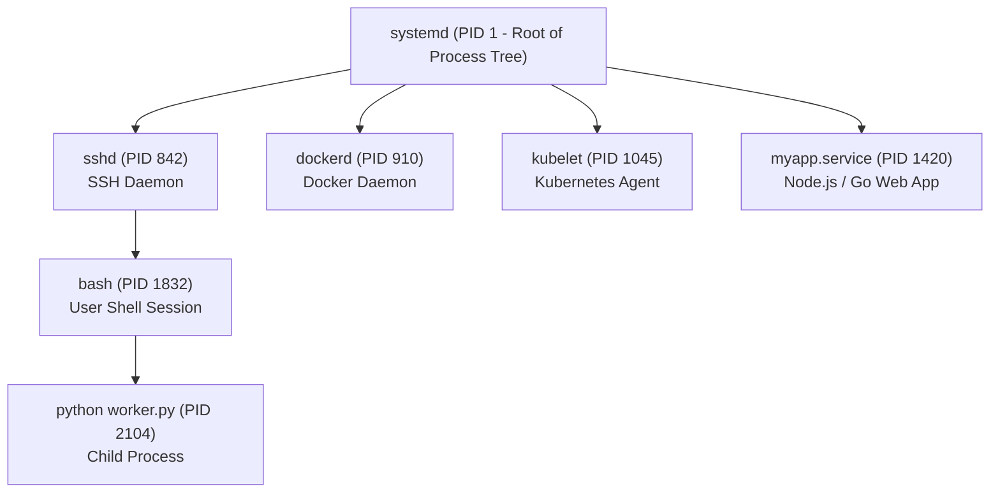

# Monitoring Processes, Signals & Systemd in Production

Linux system တစ်ခုပေါ်မှာ run နေတဲ့ application, database engine, container daemon နဲ့ background job တိုင်းဟာ **Process** တစ်ခုစီပဲ ဖြစ်ပါတယ်။ Application တစ်ခု freeze ဖြစ်သွားတာ၊ CPU 100% စားသုံးသွားတာ၊ ဒါမှမဟုတ် RAM ကုန်သွားတာမျိုးတွေ ဖြစ်လာတဲ့အခါ DevOps engineer တွေအနေနဲ့ ပြဿနာဖြစ်နေတဲ့ process ကို အမြန်ဆုံးရှာဖွေဖို့၊ သူ့ရဲ့ state ကို စစ်ဆေးဖို့၊ ပြီးတော့ **Systemd** ကိုသုံးပြီး ယုံကြည်စိတ်ချရတဲ့ background service recovery ကို configure လုပ်ဖို့ လိုအပ်ပါတယ်။



---

## 1. The Linux Process Lifecycle & States

Linux မှာရှိတဲ့ process တိုင်းကို `fork()` နဲ့ `execve()` system calls တွေကို ခေါ်ဆိုတဲ့ parent process တစ်ခုကနေ ပေါက်ဖွားလာစေတာပါ။ Boot တက်တဲ့အချိန်မှာ kernel ကနေစတင် initialize လုပ်ပေးတဲ့ ပထမဆုံး process ဟာ **PID 1 (`systemd`)** ဖြစ်ပြီး၊ အဲဒီ process ကပဲ မိဘမဲ့ (orphaned) child process တွေကို တာဝန်ယူစောင့်ရှောက်ပေးကာ တစ်ခုလုံးသော system lifecycle ကို စီမံခန့်ခွဲပေးပါတယ်။

### Process States in Linux

| State Code | Name | Description | DevOps Significance |
| :---: | :--- | :--- | :--- |
| **`R`** | Running / Runnable | CPU ပေါ်မှာ instructions တွေကို တက်ကြွစွာ run နေတာ ဒါမှမဟုတ် CPU run-queue ထဲမှာ တန်းစီနေတာ။ | Spike တွေဖြစ်နေချိန် CPU percentage မြင့်နေတဲ့ process တွေ |
| **`S`** | Interruptible Sleep | Event တစ်ခုခု၊ network packet၊ timer (သို့) I/O operation တစ်ခုခုကို စောင့်ဆိုင်းနေတာ။ | idle ဖြစ်နေတဲ့ web server တွေအတွက် ပုံမှန် state တစ်ခု |
| **`D`** | Uninterruptible Sleep | Hardware disk I/O ကို တိုက်ရိုက်စောင့်ဆိုင်းရင်း block ဖြစ်နေတာ (kill လို့ မရပါ!)။ | Fault ဖြစ်နေတဲ့ disk တွေ ဒါမှမဟုတ် ဖြည့်ဆည်းထားမှုလွန်ကဲနေတဲ့ NFS mount တွေကို ညွှန်ပြနေတာ |
| **`Z`** | Zombie / Defunct | သူ့ရဲ့ exit code ကို parent က `wait()` သုံးပြီး မဖတ်ရသေးခင်မှာ terminate ဖြစ်သွားတဲ့ process။ | တစ်ခုတည်းဆိုရင် ဘာမှမဖြစ်ပေမယ့်၊ parent process မှာ bug ရှိနေကြောင်း ပြသနေတာ |
| **`T`** | Stopped / Traced | Signal တစ်ခုခုကြောင့် (ဥပမာ <kbd>Ctrl + Z</kbd> ဒါမှမဟုတ် debugger) ရပ်တန့်ထားတာ။ | Background မှာ pause လုပ်ထားတဲ့ job |

---

## 2. Inspecting Active Processes: `ps`, `pstree` & `pgrep`

```bash
# 1. BSD Format (Most Popular in DevOps):
# a = all users, u = display user/owner format, x = include processes without a controlling tty
ps aux

# 2. System V Standard Format:
ps -ef

# 3. Find specific process by name
ps aux | grep node
pgrep -fl nginx

# 4. View hierarchical Process Tree with PIDs
pstree -p

# 5. Identify the Top 5 Memory-Consuming Processes (Instant Troubleshooting!)
ps aux --sort=-%mem | head -n 6

# 6. Identify the Top 5 CPU-Consuming Processes
ps aux --sort=-%cpu | head -n 6
```

### Deconstructing `ps aux` Columns

```text
USER       PID  %CPU %MEM    VSZ   RSS TTY      STAT START   TIME COMMAND
ubuntu    1420   4.2  8.5 950420 72100 ?        Sl   10:30   1:15 node server.js
```
- **`PID`**: သီးသန့် Process ID ဖြစ်ပါတယ်။
- **`%CPU` / `%MEM`**: Host ရဲ့ CPU cores စုစုပေါင်းနဲ့ physical RAM စုစုပေါင်းထဲက သုံးစွဲနေတဲ့ ရာခိုင်နှုန်း။
- **`VSZ`**: Virtual Memory Size (process ဝင်ရောက်သုံးစွဲနိုင်တဲ့ memory ပမာဏ အားလုံး)။
- **`RSS`**: Resident Set Size (လက်ရှိအသုံးပြုနေတဲ့ အမှန်တကယ် physical RAM pages တွေ)။
- **`STAT`**: လက်ရှိ process state (ဥပမာ `Sl` = Sleeping multi-threaded)။

---

## 3. Real-Time Resource Monitoring: `top` & `htop`

```bash
# Launch interactive monitor
top

# Interactive colored viewer (Recommended: sudo apt install -y htop)
htop
```

### Decoding the `top` Header Metrics

```text
top - 14:22:05 up 12 days,  3:14,  2 users,  load average: 0.42, 0.85, 1.12
Tasks: 184 total,   2 running, 182 sleeping,   0 stopped,   0 zombie
%Cpu(s):  6.2 us,  2.1 sy,  0.0 ni, 89.4 id,  1.8 wa,  0.0 hi,  0.5 si,  0.0 st
MiB Mem :   7960.2 total,   2140.4 free,   3820.1 used,   1999.7 buff/cache
```

1. **Load Average (1m, 5m, 15m)**: CPU ဒါမှမဟုတ် Disk ကို run နေတဲ့ (သို့) စောင့်ဆိုင်းနေတဲ့ process တွေရဲ့ ပျမ်းမျှအရေအတွက်။ 4-core machine တစ်ခုမှာဆိုရင်-
   - `Load = 2.0` → System ရဲ့ 50% ကို အသုံးပြုနေပါတယ် (ပုံမှန်ကောင်းမွန်ပါတယ်)။
   - `Load = 4.0` → System ရဲ့ 100% ကို အသုံးပြုနေပါတယ် (အပြည့်အဝ ဝန်ပိနေပါတယ်)။
   - `Load = 8.0` → System ဝန်ပိလွန်းနေပါပြီ၊ process တွေ တန်းစီနေရပါပြီ။
2. **CPU State Breakdown**:
   - **`us` (User)**: User application code တွေကို execute လုပ်ရင်း ကုန်ဆုံးသွားတဲ့အချိန်။
   - **`sy` (System)**: Kernel system calls တွေမှာ ကုန်ဆုံးသွားတဲ့အချိန်။
   - **`id` (Idle)**: အလွတ်ရှိနေသေးတဲ့ CPU စွမ်းဆောင်ရည် ရာခိုင်နှုန်း။
   - **`wa` (I/O Wait)**: Disk read/writes တွေ နှေးကွေးနေလို့ CPU က စောင့်ဆိုင်းနေရတဲ့အချိန် (storage bottleneck ကို ညွှန်ပြနေပါတယ်)။
   - **`st` (Steal)**: Shared cloud VMs တွေမှာ hypervisor က ခိုးယူသွားတဲ့ CPU cycles တွေ။

---

## 4. Linux Signals & Terminating Processes

Linux signals ဆိုတာ လုပ်ဆောင်ချက်တစ်ခုလုပ်ဖို့ process ဆီကို ပေးပို့လိုက်တဲ့ asynchronous notifications တွေပဲ ဖြစ်ပါတယ်-

| Signal | Number | Name | Action & Purpose | Can Be Caught / Ignored? |
| :---: | :---: | :--- | :--- | :---: |
| **`SIGHUP`** | `1` | Hangup | Daemon ကို restart မလုပ်ဘဲ configuration တွေကို reload လုပ်ခိုင်းဖို့ တောင်းဆိုတာ။ | Yes |
| **`SIGINT`** | `2` | Interrupt | Terminal interrupt (<kbd>Ctrl + C</kbd>)။ | Yes |
| **`SIGQUIT`**| `3` | Quit | Core dump နဲ့တကွ termination လုပ်ဖို့ တောင်းဆိုတာ (<kbd>Ctrl + Backslash</kbd>)။ | Yes |
| **`SIGKILL`**| **`9`** | Kill | **ချက်ချင်း kernel termination လုပ်တာ။** Process က ဒါကို ကြားဖြတ်တာ (သို့) ပိတ်ပင်တာ မလုပ်နိုင်ပါဘူး။ | ❌ NO |
| **`SIGTERM`**| **`15`** | Terminate | **Graceful shutdown တောင်းဆိုချက် (Default)။** Process ကို DB connections တွေ ပိတ်ခွင့်ပေးပါတယ်။ | Yes |

```bash
# 1. Graceful termination (SIGTERM - Signal 15) — ALWAYS TRY THIS FIRST!
kill 1420
# Or explicitly:
kill -15 1420

# 2. Forceful emergency termination (SIGKILL - Signal 9)
# Use only if process is frozen and unresponsive to SIGTERM
kill -9 1420

# 3. Terminate by process name directly
pkill -f "python worker.py"
killall -15 nginx

# 4. Tell Nginx to reload config without dropping active HTTP connections (SIGHUP)
kill -1 $(pgrep -f "nginx: master")
```

<Callout type="warning" title="Why SIGKILL (-9) is a Last Resort">
သင် `SIGKILL` (`kill -9`) ကို ပို့လိုက်တဲ့အခါ kernel က process ကို ချက်ချင်း ဖျက်ဆီးပစ်ပါတယ်။ Application အနေနဲ့ state ကို disk ပေါ်ရေးဖို့၊ write buffers တွေကို flush လုပ်ဖို့၊ database transactions တွေပိတ်ဖို့ (သို့) temporary socket files တွေကို ဖျက်ဖို့အတွက် **အခွင့်အလမ်း လုံးဝမရလိုက်ပါဘူး**။
</Callout>

---

## 5. Terminal Job Control: `&`, `Ctrl+Z`, `bg`, `fg` & `nohup`

```bash
# 1. Launch a command directly in the background by appending &
python backup-database.py &
# Output: [1] 28941  (Job number 1, PID 28941)

# 2. List all background jobs in current terminal session
jobs -l

# 3. Suspend a running foreground command:
# Press Ctrl + Z in terminal
# Output: [1]+  Stopped   npm run build

# 4. Resume the paused job in the background
bg %1

# 5. Bring a background job back to the foreground
fg %1

# 6. Run a command immune to SIGHUP when closing SSH session (No Hangup)
nohup python app.py > app.log 2>&1 &
```

---

## 6. Production Background Services: Writing Systemd Units

 ఆధునిక Linux distributions တွေမှာ production applications တွေကို **Systemd** ကနေ စီမံခန့်ခွဲပေးတဲ့အတွက် error တက်လာရင် automatic restart ဖြစ်သွားပြီး system boot တက်ချိန်မှာလည်း အလိုအလျောက် စတင် run ပေးပါတယ်။

### Creating a Custom Service: `/etc/systemd/system/web-api.service`

```ini
[Unit]
Description=Node.js Production Web API Service
After=network.target postgresql.service
Wants=postgresql.service

[Service]
Type=simple
User=ubuntu
Group=ubuntu
WorkingDirectory=/opt/web-api
ExecStart=/usr/bin/node /opt/web-api/dist/server.js
Restart=always
RestartSec=5s

# Security Hardening Sandbox Directives:
NoNewPrivileges=true
ProtectSystem=full
ProtectHome=read-only

# Environment Variables:
Environment=NODE_ENV=production
Environment=PORT=3000
EnvironmentFile=/etc/web-api/.env

# Standard Output and Logging:
StandardOutput=journal
StandardError=journal

[Install]
WantedBy=multi-user.target
```

### Managing the Service with `systemctl`

```bash
# 1. Reload systemd manager configuration after editing unit files
sudo systemctl daemon-reload

# 2. Start the service
sudo systemctl start web-api

# 3. Check live status and active PID
sudo systemctl status web-api

# 4. Enable service to start automatically on system boot
sudo systemctl enable web-api

# 5. Restart or Reload
sudo systemctl restart web-api
sudo systemctl reload web-api

# 6. Stop service
sudo systemctl stop web-api
```

### Inspecting Service Logs with `journalctl`

```bash
# Stream live logs for a specific service in real time (follow mode)
journalctl -u web-api -f

# View logs since 1 hour ago
journalctl -u web-api --since "1 hour ago"

# View logs with specific priority level (errors only)
journalctl -u web-api -p err
```

---

## Summary

- Linux process တိုင်းမှာ **`systemd` (PID 1)** ကနေ ဆင်းသက်လာတဲ့ **PID** တစ်ခုနဲ့ **PPID** တစ်ခုစီ ရှိကြပါတယ်။
- Performance root-cause ကို အမြန်ဆုံး ရှာဖွေစစ်ဆေးဖို့အတွက် `ps aux --sort=-%mem` နဲ့ `ps aux --sort=-%cpu` တို့ကို အသုံးပြုပါ။
- `top` ထဲက CPU states တွေဖြစ်တဲ့ `us` (application), `sy` (kernel), `wa` (disk bottleneck) နဲ့ `st` (hypervisor steal) တို့ကို နားလည်ထားပါ။
- **`SIGKILL` (9)** နဲ့ အတင်းအကျပ် မလုပ်ခင် **`SIGTERM` (15)** ကိုသုံးပြီး graceful ဖြစ်ဖြစ် အမြဲတမ်း အရင်ဆုံး ပိတ်ကြည့်ပါ။
- ရှည်ကြာစွာ run နေမယ့် production workloads တွေကို automated restarts တွေ၊ `journalctl` centralized logging တွေနဲ့တကွ **Systemd units** (`/etc/systemd/system/*.service`) အဖြစ် deploy လုပ်ပါ။

နောက်လာမယ့် သင်ခန်းစာမှာတော့ Debian/Ubuntu (`apt`), RHEL (`dnf`) နဲ့ Alpine Docker containers (`apk`) တို့တစ်လျှောက်မှာ Linux package management ကို ကျွမ်းကျင်အောင် လေ့လာရမှာ ဖြစ်ပါတယ်!