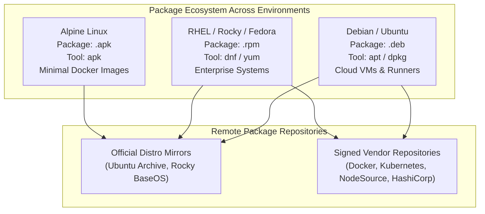
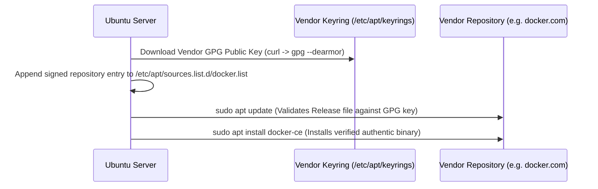

# Package Management Across Distros & Containers

Linux မှာ Software တွေကို centralized repositories တွေကနေတစ်ဆင့် packaged လုပ်ခြင်း၊ compiled လုပ်ခြင်း၊ signed လုပ်ခြင်း၊ နဲ့ distributed လုပ်ခြင်းတွေ လုပ်ဆောင်ပါတယ်။ DevOps engineer တစ်ယောက်အနေနဲ့ Ubuntu/Debian virtual machines (`apt`), enterprise Red Hat/Rocky Linux servers (`dnf`) နဲ့ lightweight Alpine Docker containers (`apk`) တွေမှာ dependencies တွေကို စီမံခန့်ခွဲရပါမယ်။



---

## 1. Package Manager နှိုင်းယှဉ်ချက်

| Distro Family | High-Level Tool (Dependencies တွေကို ဖြေရှင်းပေးသည်) | Low-Level Tool (Direct Package Operations) | Local Cache / Config Paths |
| :--- | :--- | :--- | :--- |
| **Ubuntu / Debian** | `apt` / `apt-get` | `dpkg` | `/etc/apt/sources.list`, `/var/cache/apt/archives` |
| **RHEL / Rocky / CentOS** | `dnf` / `yum` | `rpm` | `/etc/yum.repos.d/`, `/var/cache/dnf` |
| **Alpine Linux** | `apk` | `apk` | `/etc/apk/repositories`, `/etc/apk/keys` |

---

## 2. Advanced APT Management (Debian & Ubuntu)

### The Core Lifecycle: Update vs. Upgrade
Beginner တွေ အမြဲရှုပ်ထွေးတတ်တာက `apt update` နဲ့ `apt upgrade` ရဲ့ ကွာခြားချက်ပါပဲ:

```bash
# 1. apt update: Repositories တွေကနေ package INDEX lists အသစ်တွေကို ယူဆောင်လာပါတယ်။
# ဒါက ဘယ် Software ကိုမှ install လုပ်တာ ဒါမှမဟုတ် upgrade လုပ်တာမျိုး မလုပ်ပါဘူး!
sudo apt update

# 2. apt upgrade: Installed လုပ်ထားတဲ့ packages တွေရဲ့ version အသစ်တွေကို တကယ်တမ်း download လုပ်ပြီး install လုပ်ပါတယ်။
sudo apt upgrade -y

# 3. apt full-upgrade (or dist-upgrade): Dependencies တွေပြောင်းလဲတာ၊ package ဟောင်းတွေကို ဖယ်ရှားတာ 
# ဒါမှမဟုတ် sub-dependencies အသစ်တွေ install လုပ်တာတွေကိုပါ စမတ်ကျကျ ဖြေရှင်းပေးတဲ့ upgrade ဖြစ်ပါတယ်။
sudo apt full-upgrade -y
```

<Callout type="important" title="Always Run apt update Before apt install">
Cloud VM အသစ်တစ်ခုမှာ `sudo apt update` အရင်မလုပ်ဘဲ package တစ်ခုခုကို install လုပ်ဖို့ ကြိုးစားရင်၊ APT က version URLs ဟောင်းတွေကို သွားရှာလိမ့်မယ် ပြီးတော့ `404 Not Found` နဲ့ Error တက်သွားပါလိမ့်မယ်။
</Callout>

### Packages များကို Install လုပ်ခြင်း၊ ဖယ်ရှားခြင်း & Clean လုပ်ခြင်း

```bash
# Packages များကို install လုပ်ရန်
sudo apt install -y nginx curl git jq

# keyword နဲ့ ကိုက်ညီတဲ့ available packages များကို ရှာရန်
apt search postgresql

# Package ရဲ့ အသေးစိတ် metadata၊ version နဲ့ dependencies များကို ကြည့်ရန်
apt show nginx

# Package ကို ဖယ်ရှားရန် (Configuration files တွေကို /etc ထဲမှာ ဆက်ထားပေးပါတယ်)
sudo apt remove nginx

# Package ကို အကြွင်းမဲ့ ရှင်းလင်းရန် (Package ရော /etc configs အားလုံးပါ လုံးဝ ဖယ်ရှားပစ်သည်)
sudo apt purge nginx

# အသုံးမပြုတော့တဲ့ orphaned dependencies တွေကို automatic အနေနဲ့ ရှင်းလင်းရန်
sudo apt autoremove -y

# Local disk cache (/var/cache/apt/archives) ထဲက Download လုပ်ထားတဲ့ .deb archives များကို ရှင်းလင်းရန်
sudo apt clean
```

### `dpkg` ဖြင့် Low-Level Package စစ်ဆေးခြင်း

```bash
# Download လုပ်ထားတဲ့ သီးသန့် .deb file တစ်ခုကို install လုပ်ရန်
sudo dpkg -i package_name.deb

# စနစ်ထဲမှာ install လုပ်ထားတဲ့ packages အားလုံးကို ဖော်ပြရန်
dpkg -l

# သတ်မှတ်ထားတဲ့ package တစ်ခု install ဖြစ်မဖြစ် ရှာရန်
dpkg -l | grep docker

# သတ်မှတ်ထားတဲ့ package တစ်ခုက install လုပ်ထားတဲ့ files နဲ့ directories တွေအားလုံးကို ကြည့်ရန်
dpkg -L nginx

# Disk ပေါ်က သတ်မှတ်ထားတဲ့ file တစ်ခုကို ဘယ် package က ပိုင်ဆိုင်လဲ ရှာရန် (Troubleshooting အတွက် အရမ်းကောင်းပါတယ်!)
dpkg -S /etc/nginx/nginx.conf
# Output: nginx-common: /etc/nginx/nginx.conf
```

---

## 3. Signed Third-Party Repositories များကို ထည့်သွင်းခြင်း (Docker / NodeSource)

Modern DevOps installations တွေဖြစ်တဲ့ (Docker Engine, Kubernetes tools `kubectl`, ဒါမှမဟုတ် HashiCorp `terraform` လိုမျိုး) အတွက် vendor-signed GPG keys နဲ့ custom repository sources တွေကို `/etc/apt/sources.list.d/` ထဲမှာ ထည့်သွင်းပေးဖို့ လိုအပ်ပါတယ်:



### Production Example: Ubuntu ပေါ်တွင် Docker CE ကို Install လုပ်ခြင်း

```bash
# 1. လိုအပ်တဲ့ utilities များကို install လုပ်ရန်
sudo apt update
sudo apt install -y ca-certificates curl gnupg lsb-release

# 2. လုံခြုံတဲ့ keyring directory အသစ် ဖန်တီးရန်
sudo install -m 0755 -d /etc/apt/keyrings

# 3. Docker ရဲ့ official GPG key ကို download လုပ်ပြီး dearmored binary format ပြောင်းရန်
curl -fsSL https://download.docker.com/linux/ubuntu/gpg | \
  sudo gpg --dearmor -o /etc/apt/keyrings/docker.gpg
sudo chmod a+r /etc/apt/keyrings/docker.gpg

# 4. Docker repository source ကို APT sources.list.d ထဲသို့ ထည့်ရန်
echo \
  "deb [arch=$(dpkg --print-architecture) signed-by=/etc/apt/keyrings/docker.gpg] https://download.docker.com/linux/ubuntu \
  $(lsb_release -cs) stable" | sudo tee /etc/apt/sources.list.d/docker.list > /dev/null

# 5. Index ကို update လုပ်ပြီး install လုပ်ရန်
sudo apt update
sudo apt install -y docker-ce docker-ce-cli containerd.io docker-compose-plugin
```

---

## 4. Enterprise Package Management: DNF & RPM (RHEL / Rocky)

```bash
# 1. Update တွေရှိမရှိ စစ်ဆေးပြီး repository metadata ကို refresh လုပ်ရန်
sudo dnf check-update

# 2. System packages အားလုံးကို upgrade လုပ်ရန်
sudo dnf upgrade -y

# 3. Packages များကို install လုပ်ရန်
sudo dnf install -y nginx git

# 4. Package information များကို ရှာဖွေပြီး ပြသရန်
dnf search postgresql
dnf info nginx

# 5. Low-level RPM queries:
rpm -qa               # Install လုပ်ထားတဲ့ RPM packages အားလုံးကို ရှာရန်
rpm -ql nginx         # nginx က install လုပ်ထားတဲ့ files စာရင်းကို ရှာရန်
rpm -qf /bin/ls       # /bin/ls ကို ဘယ် RPM package က ပိုင်ဆိုင်လဲ ရှာရန်
```

---

## 5. Container Package Management: APK (Alpine Linux)

Alpine base images (`alpine:3.19` သို့မဟုတ် `node:alpine`) ကို သုံးတဲ့ Dockerfiles တွေမှာ `apk` (Alpine Package Keeper) က Image အရွယ်အစား သေးငယ်စေဖို့အတွက် caching မပါဘဲ minimal packages များကို install လုပ်ပေးပါတယ်:

```dockerfile
FROM alpine:3.19

# --no-cache က index archives တွေကို /var/cache/apk/ ထဲ download လုပ်တာကို ရှောင်ရှားပေးပြီး
# Docker image ရဲ့ ပမာဏကို 10-20MB အထိ သေးငယ်သွားစေပါတယ်!
RUN apk update && apk add --no-cache \
    curl \
    git \
    jq \
    ca-certificates

CMD ["sh"]
```

---

## အနှစ်ချုပ်

- Repository index metadata ကို refresh လုပ်ဖို့ **`apt update`** ကို သုံးပါ၊ Software patches တွေ install လုပ်ဖို့ **`apt upgrade`** ကို သုံးပါ။
- သတ်မှတ်ထားတဲ့ Configuration file တစ်ခုကို ဘယ် package က ပိုင်ဆိုင်လဲ သိရဖို့ **`dpkg -S <path>`** ကို သုံးပါ။
- Vendor tools တွေ (Docker, Kubernetes, HashiCorp) ကို လုံခြုံစွာ install လုပ်ဖို့ GPG keys တွေကို **`/etc/apt/keyrings/`** ထဲ download လုပ်ပြီး source lines တွေကို **`/etc/apt/sources.list.d/`** ထဲ ထည့်သွင်းပါ။
- Enterprise Linux တွေမှာဆိုရင် **`dnf`** နဲ့ **`rpm`** ကို သုံးပါ။
- Docker containers တွေမှာဆိုရင် ultra-minimal ဖြစ်ပြီး layer-optimized ဖြစ်တဲ့ base images ရရှိဖို့ **`apk add --no-cache`** ကို သုံးပါ။

နောက်တစ်ခန်းမှာတော့ Linux networking အကြောင်း၊ IP routing တွေကို စစ်ဆေးတာ၊ `ss -tulnp` သုံးပြီး open socket ports တွေကို စစ်ဆေးတာ၊ နဲ့ `curl` သုံးပြီး HTTP APIs တွေကို test လုပ်တာတွေကို လေ့လာသွားမှာ ဖြစ်ပါတယ်!