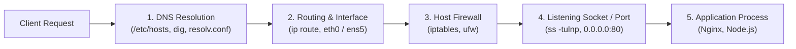
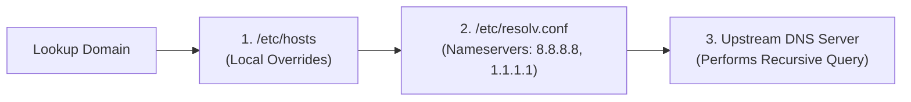

# Linux Networking & Service Diagnostics

Container တစ်ခုက database ကို မချိတ်နိုင်တာပဲဖြစ်ဖြစ်၊ API က 502 Bad Gateway ပြန်တာပဲဖြစ်ဖြစ်၊ ဒါမှမဟုတ် microservice port ကို ဝင်လို့မရတာပဲဖြစ်ဖြစ် ကြုံလာရတဲ့အခါ DevOps engineers တွေအနေနဲ့ packet တွေကို ခြေရာခံဖို့ (trace)၊ listening sockets တွေကို စစ်ဆေးဖို့၊ DNS resolution ကို စမ်းသပ်ဖို့နဲ့ HTTP calls တွေကို simulation လုပ်ဖို့ Linux networking tools တွေကို အသုံးပြုကြပါတယ်။



---

## 1. Network Interfaces & IP Addressing: `ip`

Modern Linux တွေမှာတော့ ရှေးဟောင်း deprecated ဖြစ်သွားတဲ့ `ifconfig` အစား `iproute2` suite (`ip` command) ကို အသုံးပြုကြပါပြီ -

```bash
# 1. Network interfaces အားလုံးနဲ့ ချိတ်ဆက်ထားတဲ့ IP addresses တွေကို ကြည့်ရှုခြင်း
ip addr
# ဒါမှမဟုတ် အတိုချုပ် ကြည့်ချင်ရင် -
ip -brief addr

# 2. Default gateway နဲ့ routing table ကို ကြည့်ရှုခြင်း
ip route

# 3. Interface တစ်ခုကို ဖွင့်ခြင်း သို့မဟုတ် ပိတ်ခြင်း
sudo ip link set dev eth0 down
sudo ip link set dev eth0 up
```

### Common Linux Network Interface Types

| Interface Name | Type | Typical IP Address | Purpose |
| :--- | :--- | :--- | :--- |
| **`lo`** | Loopback | `127.0.0.1` (`localhost`) | စက်တစ်ခုတည်းအတွင်းမှာရှိတဲ့ processes တွေအချင်းချင်း ချိတ်ဆက်ဖို့ |
| **`eth0` / `ens5`** | Physical / Cloud NIC | `10.0.1.25` သို့မဟုတ် Public IP | VPC / Internet နဲ့ ချိတ်ဆက်ထားတဲ့ မူလ network card |
| **`docker0`** | Virtual Bridge | `172.17.0.1` | Docker ရဲ့ မူလ container bridge network |
| **`cni0` / `flannel.1`** | Kubernetes Overlay | `10.244.0.1` | Kubernetes ထဲက Container Network Interface (CNI) |

---

## 2. DNS Resolution & Troubleshooting: `dig` & `nslookup`

Application တစ်ခုက `api.stripe.com` ဒါမှမဟုတ် `postgres.internal` ကို ချိတ်ဆက်လို့မရတော့ဘူးဆိုရင် DNS lookup chain ကို အောက်ပါအတိုင်း ဖြေရှင်းစစ်ဆေးနိုင်ပါတယ် -



### Inspecting DNS Configuration
```bash
# Local static IP-to-hostname mappings တွေကို ကြည့်ရှုခြင်း
cat /etc/hosts

# Configure လုပ်ထားတဲ့ upstream DNS nameservers တွေကို ကြည့်ရှုခြင်း
cat /etc/resolv.conf
# nameserver 127.0.0.53 (Local systemd-resolved DNS cache)
# nameserver 8.8.8.8     (Google Public DNS)
```

### Querying DNS with `dig`

```bash
# Standard DNS query (A records, query time နဲ့ server response တွေ ပြန်ပေးပါတယ်)
dig github.com

# Short output (Resolved IP address ကို သီးသန့်ထုတ်ပေးပါတယ်) — Scripts တွေအတွက် အရမ်းကောင်းပါတယ်!
dig +short github.com

# သီးသန့် DNS record types တွေကို query လုပ်ခြင်း (MX = Mail, TXT = Verification, CNAME)
dig MX google.com
dig TXT _github-challenge.example.com +short

# သီးသန့် DNS server တစ်ခုကို တိုက်ရိုက် query လုပ်ခြင်း (Local resolver ကို ကျော်ပြီးတော့ပေါ့)
dig @1.1.1.1 github.com

# Reverse DNS lookup (IP address ကို ပြန်ပြီး domain name အဖြစ် ပြောင်းလဲရှာဖွေခြင်း)
dig -x 140.82.121.4 +short
```

---

## 3. Sockets, Ports & Listening Services: `ss` & `lsof`

TCP/IP networking မှာ applications တွေဟာ numerical ports (0–65535) တွေနဲ့ ချိတ်ဆက်ကြပါတယ်။ System ports (1–1023) တွေကတော့ ချိတ်ဆက်ဖို့အတွက် `root`/`sudo` privileges လိုအပ်ပါတယ်။

Modern Linux တွေမှာ ရှေးဟောင်း `netstat` အစား **`ss` (Socket Statistics)** ကို အသုံးပြုကြပါတယ် -

```bash
# Process names နဲ့ Numeric IPs တွေပါတဲ့ Listening TCP နဲ့ UDP ports အားလုံးကို ပြသခြင်း
# -t (TCP), -u (UDP), -l (Listening), -n (Numeric ports/IPs), -p (Show Process/PID)
sudo ss -tulnp
```

### Decoding `ss -tulnp` Output

```text
Netid  State   Recv-Q  Send-Q   Local Address:Port   Peer Address:Port   Process
tcp    LISTEN  0       511            0.0.0.0:80          0.0.0.0:*       users:(("nginx",pid=1420,fd=6))
tcp    LISTEN  0       128          127.0.0.1:5432        0.0.0.0:*       users:(("postgres",pid=910,fd=3))
tcp    LISTEN  0       511                  *:3000              *:*       users:(("node",pid=2104,fd=18))
```

<Callout type="important" title="0.0.0.0 vs 127.0.0.1 (Security Architecture)">
- **`127.0.0.1:5432`**: Localhost မှာသာ *တင်းတင်းကျပ်ကျပ်* ချိတ်ဆက်ထားတာပါ။ Local machine ပေါ်က processes တွေကနေသာ ဝင်ရောက်သုံးစွဲနိုင်ပါတယ် (Private databases တွေအတွက် လုံခြုံပါတယ်)။
- **`0.0.0.0:80` (သို့မဟုတ် `*:80`)**: Network interfaces **အားလုံး** မှာ ချိတ်ဆက်ထားပါတယ်။ Public internet ဒါမှမဟုတ် external VPC network ကနေ ဝင်ရောက်သုံးစွဲနိုင်ပါတယ်!
</Callout>

### Finding What Process is Hogging a Port with `lsof`

```bash
# Port 3000 ကို ဘယ် PID က အသုံးပြုနေလဲဆိုတာ ရှာဖွေခြင်း
sudo lsof -i :3000
# Output:
# COMMAND   PID   USER   FD   TYPE DEVICE SIZE/OFF NODE NAME
# node     2104 ubuntu   18u  IPv4  38291      0t0  TCP *:3000 (LISTEN)

# Port ကို ယူထားတဲ့ process ကို ရပ်ပစ်ခြင်း
sudo kill -9 2104
```

---

## 4. Connectivity Diagnostics: `ping`, `nc` & `mtr`

```bash
# 1. ICMP network reachability နဲ့ packet latency ကို စမ်းသပ်ခြင်း (-c 4 က ping 4 ခါပဲ လုပ်ဖို့ ကန့်သတ်တာပါ)
ping -c 4 8.8.8.8

# 2. Application data မပို့ဘဲ remote TCP port တစ်ခု OPEN ဖြစ်မဖြစ် စမ်းသပ်ခြင်း (Netcat)
# -z (Zero-I/O scan mode), -v (Verbose), -w 3 (3 စက္ကန့်ကြာရင် timeout ဖြစ်မယ်)
nc -zv 10.0.1.50 5432
# Output: Connection to 10.0.1.50 5432 port [tcp/postgresql] succeeded!

# 3. Packet path ကို ခြေရာခံပြီး hop-by-hop latency/packet loss ကို စစ်ဆေးခြင်း (MTR)
mtr --report --report-cycles 10 github.com
```

---

## 5. HTTP Testing & API Probing with `curl`

`curl` (Client URL) ကတော့ web servers, REST APIs နဲ့ container health endpoints တွေကို စမ်းသပ်ဖို့အတွက် Swiss Army knife လိုမျိုး အသုံးဝင်ပါတယ်။

```bash
# 1. Simple GET request
curl https://api.mycompany.com/health

# 2. HTTP Response Headers များကိုသာ စစ်ဆေးခြင်း (-I / --head)
curl -I https://api.mycompany.com/

# 3. Verbose debugging mode (-v): TLS handshake, request နဲ့ response headers တွေကို ပြသပေးပါတယ်
curl -v https://api.mycompany.com/

# 4. CI/CD မှာ HTTP 4xx/5xx errors တက်ရင် silent ဖြစ်ဖြစ် fail စေရန် (-f / --fail)
# API က error ပြန်ရင် GitHub Actions failသွားအောင် non-zero exit code နဲ့ ထွက်သွားစေပါတယ်!
curl -f -s https://api.mycompany.com/health || exit 1

# 5. HTTP 301/302 Redirects များကို လိုက်သွားခြင်း (-L)
curl -L http://github.com

# 6. JSON Body နဲ့ Custom Headers ပါတဲ့ HTTP POST ကို ပို့ခြင်း
curl -X POST https://api.mycompany.com/v1/orders \
  -H "Content-Type: application/json" \
  -H "Authorization: Bearer my_jwt_token" \
  -d '{"productId": "prod_123", "quantity": 2}'

# 7. Performance auditing အတွက် အချိန်ပိုင်းခြားချက်များကို ကြည့်ရှုခြင်း (-w formatted output)
curl -s -o /dev/null -w "DNS: %{time_namelookup}s | Connect: %{time_connect}s | TTFB: %{time_starttransfer}s | Total: %{time_total}s\n" https://api.mycompany.com
```

---

## 6. Host Firewall Management with `ufw`

Ubuntu/Debian တွေမှာတော့ **UFW (Uncomplicated Firewall)** က Linux `iptables`/`nftables` packet filtering တွေကို configure လုပ်ပေးပါတယ် -

```bash
# Firewall status နဲ့ active rules တွေကို စစ်ဆေးခြင်း
sudo ufw status verbose

# SSH traffic ကို ခွင့်ပြုခြင်း (အရေးကြီးသည်: Lockout မဖြစ်အောင် firewall မဖွင့်ခင် ဒါကို အရင်လုပ်ပါ!)
sudo ufw allow 22/tcp

# HTTP နဲ့ HTTPS web traffic တွေကို ခွင့်ပြုခြင်း
sudo ufw allow 80/tcp
sudo ufw allow 443/tcp

# သတ်မှတ်ထားတဲ့ trusted bastion IP address တစ်ခုကနေပဲ ဝင်ရောက်ခွင့်ပေးခြင်း
sudo ufw allow from 203.0.113.50 to any port 22

# Firewall ကို ဖွင့်ခြင်း
sudo ufw enable

# Rule တစ်ခုကို ဖျက်ခြင်း
sudo ufw delete allow 80/tcp
```

---

## Summary

- Network interfaces, bridges (`docker0`, `cni0`) နဲ့ default gateways တွေကို စစ်ဆေးဖို့ **`ip addr`** နဲ့ **`ip route`** ကို အသုံးပြုပါ။
- **`dig +short domain.com`** နဲ့ direct server queries (**`dig @8.8.8.8`**) သုံးပြီး DNS resolution ကို ခြေရာခံပါ။
- Listening ports တွေကို **`sudo ss -tulnp`** နဲ့ စစ်ဆေးပြီး port conflicts တွေကို **`sudo lsof -i :<port>`** သုံးပြီး ရှာဖွေပါ။
- Netcat ကိုသုံးပြီး raw TCP port connectivity ကို စမ်းသပ်ပါ: **`nc -zv host port`**။
- **`curl`** flags တွေကို ကျွမ်းကျင်အောင် လုပ်ပါ: **`-I`** (headers), **`-v`** (debug), **`-f`** (CI/CD error exit code), နှင့် **`-X POST -d`** (API testing)။
- မရှိမဖြစ်လိုအပ်တဲ့ traffic များကို **`ufw allow`** သုံးပြီး ခွင့်ပြုပေးခြင်းဖြင့် host များကို ကာကွယ်ပါ။

နောက်သင်ခန်းစာမှာတော့ SSH cryptography, Ed25519 keypairs, `~/.ssh/config` နဲ့ bastion host jumping ပြုလုပ်ခြင်းတို့ကို လေ့လာရမှာ ဖြစ်ပါတယ်။