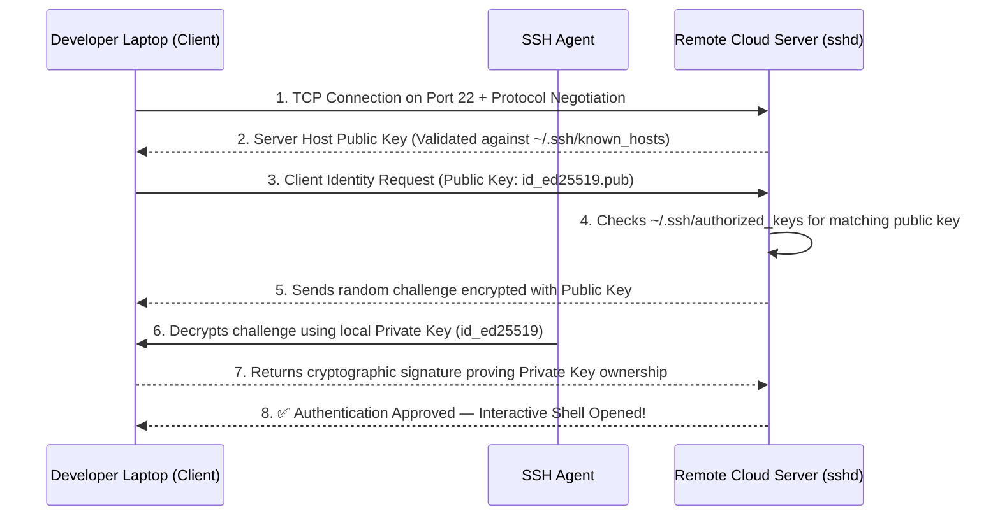

# Secure Remote Server Access & Automation

**Secure Shell (SSH)** ဆိုတာကတော့ မလုံခြုံတဲ့ network တွေပေါ်မှာ encrypted ဖြစ်တဲ့ communication တွေလုပ်ဖို့နဲ့ remote ကနေ administrative command တွေ execute လုပ်ဖို့ အသုံးပြုတဲ့ cryptographic network protocol တစ်ခု ဖြစ်ပါတယ်။ DevOps မှာဆိုရင် SSH ကို cloud virtual machines တွေ manage လုပ်ဖို့၊ CI/CD deployment jobs တွေ run ဖို့၊ database connections တွေ tunnel လုပ်ဖို့နဲ့ Git repositories တွေဆီ authentication လုပ်ဖို့ စတာတွေအတွက် အသုံးပြုပါတယ်။



---

## 1. Asymmetric Cryptography: Public vs. Private Keys

SSH authentication ဟာ asymmetric public-key cryptography ပေါ်မှာ အခြေခံထားပါတယ်-

- **Public Key (`id_ed25519.pub`)**: ဖွင့်ထားတဲ့ **ခလောက် (Padlock)** တစ်ခုနဲ့ တူပါတယ်။ ဒီ public string ကို GitHub၊ AWS EC2 တို့နဲ့ လွတ်လွတ်လပ်လပ် မျှဝေလို့ရသလို၊ server တွေပေါ်က `~/.ssh/authorized_keys` ထဲကိုလည်း ထည့်သွင်းနိုင်ပါတယ်။
- **Private Key (`id_ed25519`)**: အဲ့ဒီခလောက်ကို ဖွင့်နိုင်တဲ့ **ပင်မသော့ချက် (Master key)** တစ်ခုနဲ့ တူပါတယ်။ ဒီ key ဟာ မဖြစ်မနေ ကိုယ့်ရဲ့ personal laptop မှာပဲ ရှိရမှာဖြစ်ပြီး၊ **ဘယ်တော့မှ** အပြင်ကို ထွက်သွားတာ၊ လုပ်ဖော်ကိုင်ဖက်တွေကို မျှဝေတာ၊ ဒါမှမဟုတ် Git repository ထဲ commit တင်တာမျိုး လုံးဝ မလုပ်ရပါဘူး။

---

## 2. Generating Modern SSH Keypairs with `ssh-keygen`

ခေတ်စားနေတဲ့ **Ed25519** elliptic-curve algorithm ကိုသုံးပြီး keys တွေကို အမြဲ generate လုပ်ပါ (ဟောင်းနေပြီဖြစ်တဲ့ RSA ထက် ပိုမြန်တယ်၊ ပိုတိုတယ်၊ cryptographically အရလည်း ပိုကောင်းပါတယ်):

```bash
# Generate a new Ed25519 SSH keypair with an identifying comment/email
ssh-keygen -t ed25519 -C "devops.engineer@mycompany.com"
```

1. **Location**: default file path (`~/.ssh/id_ed25519`) ကိုပဲ လက်ခံဖို့အတွက် <kbd>Enter</kbd> ကို နှိပ်လိုက်ပါ။
2. **Passphrase**: ကိုယ့် laptop ပေါ်မှာ private key ကို encrypt လုပ်ထားဖို့အတွက် ခိုင်မာတဲ့ passphrase တစ်ခု ထည့်ပါ။
3 ဒါဟာ `~/.ssh/` ထဲမှာ ဖိုင်နှစ်ခုကို ဖန်တီးပေးပါလိမ့်မယ်-
   - `id_ed25519` (Private Key — permissions က `600` ဖြစ်ရပါမယ်)
   - `id_ed25519.pub` (Public Key — ဖြန့်ဝေလို့ရပါတယ်)

```bash
# View your public key string (ready to copy to GitHub or cloud servers)
cat ~/.ssh/id_ed25519.pub
# Output: ssh-ed25519 AAAAC3NzaC1lZDI1NTE5AAAAI... devops.engineer@mycompany.com
```

---

## 3. Authorizing Keys on Remote Servers: `ssh-copy-id`

Remote server တစ်ခုဆီကို ကိုယ့်ရဲ့ keypair နဲ့ login ဝင်လို့ရအောင်လုပ်ဖို့ဆိုရင် public key ကို server ရဲ့ `~/.ssh/authorized_keys` ဖိုင်ထဲကို ထည့်ပေးရပါမယ်။

```bash
# Automated copy (prompts for server password once, then installs public key):
ssh-copy-id -i ~/.ssh/id_ed25519.pub ubuntu@203.0.113.50

# Manual installation (if ssh-copy-id is unavailable):
cat ~/.ssh/id_ed25519.pub | ssh ubuntu@203.0.113.50 "mkdir -p ~/.ssh && chmod 700 ~/.ssh && cat >> ~/.ssh/authorized_keys && chmod 600 ~/.ssh/authorized_keys"
```

### Mandatory File Permissions (Strictly Enforced by SSH)

Client သို့မဟုတ် server ပေါ်ရှိ SSH ဖိုင်တွေရဲ့ permissions တွေက လွတ်လွတ်လပ်လပ် ပွင့်နေမယ်ဆိုရင် SSH daemon (`sshd`) က connection ချိတ်ဆက်မှုကို **တမင်သက်သက် ငြင်းပယ်ပစ်မှာ** ဖြစ်ပါတယ်-

```bash
# On your local machine (Client):
chmod 700 ~/.ssh
chmod 600 ~/.ssh/id_ed25519
chmod 644 ~/.ssh/id_ed25519.pub
chmod 644 ~/.ssh/known_hosts

# On the remote server:
chmod 700 ~/.ssh
chmod 600 ~/.ssh/authorized_keys
```

---

## 4. Masterclass: Advanced `~/.ssh/config` Architecture

IP address တွေ၊ custom ports တွေနဲ့ ရှည်လျားတဲ့ key paths တွေကို အလွတ်ကျက်နေမယ့်အစား `~/.ssh/config` မှာ aliases တွေ သတ်မှတ် configure လုပ်ပါ:

```text
# ~/.ssh/config

# Global settings for all hosts
Host *
    ServerAliveInterval 60
    ServerAliveCountMax 3
    AddKeysToAgent yes
    UseKeychain yes
    IdentitiesOnly yes

# Public-facing Bastion / Jump Host
Host bastion
    HostName 203.0.113.10
    User ec2-user
    Port 22
    IdentityFile ~/.ssh/id_ed25519

# Private Production Kubernetes Master (Hidden inside VPC — Jumps through Bastion!)
Host k8s-prod-master
    HostName 10.0.10.45
    User ubuntu
    IdentityFile ~/.ssh/id_ed25519
    ProxyJump bastion

# Staging Web Server with Non-Standard Port
Host staging-web
    HostName staging.mycompany.com
    User deploy
    Port 2222
    IdentityFile ~/.ssh/id_staging
```

ဒီ configuration နဲ့ဆိုရင် command တစ်ခုတည်းနဲ့ isolated ဖြစ်နေတဲ့ private VPC node တစ်ခုဆီကို SSH ဝင်လို့ရပါပြီ:

```bash
# Automatically tunnels through the bastion host securely!
ssh k8s-prod-master
```

---

## 5. Secure File Transfer: `scp` vs. `rsync`

`scp` က တစ်ခါသုံး file transfers တွေကို ရိုးရိုးရှင်းရှင်း လုပ်ဆောင်ပေးနိုင်ပေမဲ့၊ **`rsync`** ကတော့ DevOps အတွက် နံပါတ်တစ် ရွှေစံနှုန်းဖြစ်တဲ့ tool တစ်ခုဖြစ်ပါတယ်။ ဘာဖြစ်လို့လဲဆိုတော့ သူက ပြောင်းလဲသွားတဲ့ file differences တွေကိုပဲ (delta-transfer) ပို့ပေးလို့ပါ၊ connection ပြတ်သွားရင် ပြန်စလို့ရတာကို (resume) ထောက်ပံ့ပေးပြီး file metadata တွေကိုလည်း ထိန်းသိမ်းပေးပါတယ်။

```bash
# 1. SCP: Copy a local file to remote server
scp docker-compose.yml staging-web:/opt/app/

# 2. RSYNC: Sync an entire build directory with compression and progress
# -a (Archive: preserves permissions, symlinks, timestamps)
# -v (Verbose)
# -z (Compress data during network transfer)
# -P (Show Progress bar and keep Partial files for resume)
# --delete (Remove files on destination that no longer exist in source)
rsync -avzP --delete ./dist/ staging-web:/var/www/html/

# 3. RSYNC over custom SSH port or through SSH config alias
rsync -avzP -e "ssh -p 2222" ./data/ deploy@203.0.113.50:/opt/data/
```

---

## 6. Production SSH Server Hardening (`/etc/ssh/sshd_config`)

Cloud servers တွေကို provisioning လုပ်တဲ့အခါ brute-force scanners တွေလက်ကနေ SSH daemon ကို လုံခြုံအောင် အခုလို လုပ်ပါ။

```bash
sudo nano /etc/ssh/sshd_config
```

```ini
# /etc/ssh/sshd_config — Production Hardened Settings

# 1. Disable Root Login (Enforce logging in as normal user, then using sudo)
PermitRootLogin no

# 2. Disable Password Authentication (Mandate SSH Public Keys Only!)
PasswordAuthentication no
PermitEmptyPasswords no
PubkeyAuthentication yes

# 3. Restrict Authentication Attempts to prevent brute-force
MaxAuthTries 3
MaxSessions 5

# 4. Restrict allowed users
AllowUsers ubuntu deploy-runner

# 5. Disable legacy X11 & agent forwarding
X11Forwarding no
AllowAgentForwarding no
```

### Applying Changes Safely

<Callout type="danger" title="Always Validate Syntax Before Reloading sshd!">
`sshd_config` ကို modify လုပ်တဲ့အခါ ကိုယ်လက်ရှိသုံးနေတဲ့ terminal session ကို ဘယ်တော့မှ ပိတ်မပစ်ပါနဲ့။ Syntax error တစ်ခုခုရှိပြီး sshd restart လုပ်လို့ မအောင်မြင်ဘူးဆိုရင် server ထဲကို လုံးဝဝင်လို့မရတော့ဘဲ သော့ခတ်ခံရပါလိမ့်မယ်!

```bash
# 1. Test configuration file for syntax errors
sudo sshd -t

# 2. If no errors are returned, reload the daemon cleanly
sudo systemctl reload ssh

# 3. Open a SECOND terminal window and verify you can log in before closing the first!
ssh ubuntu@myserver
```
</Callout>

---

## Summary

- ခေတ်မီပြီး performance ကောင်းမွန်တဲ့ cryptography အတွက် **Ed25519** (`ssh-keygen -t ed25519`) ကို သုံးပါ။
- Public keys တွေက `~/.ssh/authorized_keys` ထဲမှာ ရှိရမှာဖြစ်ပြီး၊ Private keys တွေကတော့ လျှို့ဝှက်ချက်အနေနဲ့ တင်းတင်းကျပ်ကျပ် ရှိရပါမယ်။
- Permissions တွေကို တင်းကျပ်ထားရပါမယ်: `~/.ssh` အတွက် **`700`** နဲ့ private keys တွေအတွက် **`600`** ဖြစ်ရပါမယ်။
- Multi-node VPC infrastructure တွေကို **`~/.ssh/config`** နဲ့ **`ProxyJump`** သုံးပြီး သပ်သပ်ရပ်ရပ် စီမံခန့်ခွဲပါ။
- Efficient ဖြစ်တဲ့ delta-compressed file synchronization အတွက် **`rsync -avzP`** ကို သုံးပါ။
- Production servers တွေကို **`PasswordAuthentication no`** နဲ့ **`PermitRootLogin no`** ဆိုပြီး သတ်မှတ်ကာ လုံခြုံအောင် တည်ဆောက်ပါ။

နောက်ဆုံး သင်ခန်းစာမှာတော့ Unix pipes, stream redirection (`>`, `2>&1`), shell scripting best practices (`set -euo pipefail`) နဲ့ `tmux` ကိုသုံးပြီး terminal multiplexing လုပ်တာတွေကို အသေးစိတ် သင်ယူရမှာ ဖြစ်ပါတယ်!