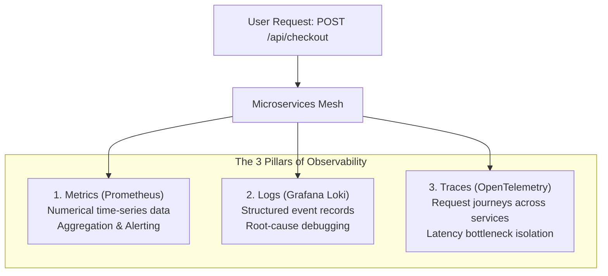
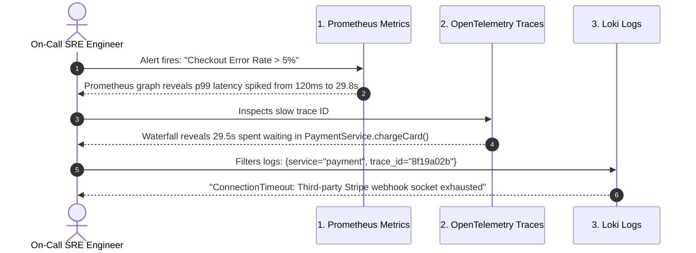

# The 3 Pillars of Observability

ခေတ်ပေါ် distributed architectures (Kubernetes clusters, microservices, multi-cloud platforms) တွေမှာ system တွေက ခန့်မှန်းရခက်ပြီး ရှုပ်ထွေးတဲ့ပုံစံတွေနဲ့ မျိုးစုံ error တက်တတ်ပါတယ်။

Traditional ဖြစ်တဲ့ **Monitoring** က ဒီလိုမေးခွန်းမျိုးကို ဖြေပေးပါတယ်: *"System အလုပ်လုပ်နေရဲ့လား?"* (ဥပမာ- endpoint တစ်ခုကို 60 စက္ကန့်တစ်ကြိမ် ping စစ်တာမျိုးပေါ့)။
ဒါပေမဲ့ **Observability** ကကျတော့ external outputs တွေကနေ internal state ကို တွက်ချက်ပြီး *"System ဘာကြောင့် ဒီလိုဖြစ်နေတာလဲ?"* ဆိုတာကို ဖြေပေးပါတယ်။

---

## Comparing the Three Pillars

| Dimension | Metrics (Prometheus) | Logs (Grafana Loki) | Traces (OpenTelemetry / Tempo) |
| :--- | :--- | :--- | :--- |
| **Data Format** | Float64 + Key/Value Labels | Structured JSON / String Lines | Spans with timestamps & metadata |
| **Volume & Cost** | Lowest (compact time-series) | Highest (huge text volume) | Medium (often sampled e.g. 10%) |
| **Best For** | Real-time alerts, CPU/RAM rates, p99 latency | Exact error stack traces & audit events | Distributed latency bottlenecks across services |
| **Query Speed** | Instant (< 50ms) | Fast with labels (< 1s) | Fast per Trace ID (< 200ms) |

---

## The Core SRE Frameworks

System တွေကို instrument လုပ်တဲ့အခါ ထိပ်တန်း SRE team တွေဟာ ဒေတာတွေကို လေလွင့်ပြီး စုဆောင်းတာမျိုး မလုပ်ဘဲ standard frameworks တွေအတိုင်း လုပ်ဆောင်ကြပါတယ်။

### 1. The 4 Golden Signals (Google SRE)
- **Latency**: Request တစ်ခုပြီးဆုံးဖို့ ဘလောက်ကြာလဲ (successful requests တွေနဲ့ failed requests တွေကို ခွဲခြားပြပါတယ်။)
- **Traffic**: System ပေါ်မှာ load ဘလောက်ရှိလဲ (HTTP requests/sec သို့မဟုတ် network I/O)။
- **Errors**: Error တက်တဲ့ request တွေရဲ့ နှုန်း (explicit 5xx errors တွေ သို့မဟုတ် unexpected payload content တွေ)။
- **Saturation**: Service ဟာ ဘလောက်အထိ "ပြည့်ကျပ်" နေပြီလဲ (CPU, memory limits, database connection pool exhaustion တွေပေါ့)။

### 2. The RED Method (Best for Web APIs & Microservices)
- **Rate**: တစ်စက္ကန့်ကို Request ဘလောက်ဝင်နေလဲ။
- **Errors**: တစ်စက္ကန့်ကို Error ဘလောက်တက်နေလဲ။
- **Duration**: Request တွေ ပြီးဆုံးဖို့ ကြာချိန် (p50, p95, p99 percentiles)။

### 3. The USE Method (Best for Host Hardware & Virtual Machines)
- **Utilization**: Resource တစ်ခု အလုပ်များနေတဲ့ အချိန်ရာခိုင်နှုန်း (ဥပမာ- 85% CPU core usage)။
- **Saturation**: အလုပ်တွေကို queue တင်ထားရတဲ့ ပမာဏ (ဥပမာ- Linux 1-min load average က core count ထက် ကျော်နေတာမျိုး)။
- **Errors**: Hardware သို့မဟုတ် device driver error event အရေအတွက်။

---

## Real-World Incident Case Study: Debugging a 504 Gateway Timeout

Black Friday လိုအချိန်မျိုးမှာ သင့်ရဲ့ e-commerce checkout service ကနေ `504 Gateway Timeout` တွေ စပြီး ပြန်လာတယ်လို့ စဉ်းစားကြည့်ပါ။ ဒီလိုအခြေအနေမျိုးမှာ the 3 pillars က ဘယ်လို အတူတကွ အလုပ်လုပ်ကြမလဲ?

1. **Metrics** က သင့်ကို issue တစ်ခုရှိနေကြောင်း alert ပေးပြီး ပြဿနာဖြစ်တဲ့ နေရာကို လက်ညှိုးထိုးပြပါမယ်။
2. **Traces** က 29 စက္ကန့်ကြာအောင် ကြန့်ကြာနေစေတဲ့ microservice hop ကို တိတိကျကျ ခွဲထုတ်ပေးပါတယ်။
3. **Logs** ကတော့ Bug ကို ရှင်းဖို့အတွက် အတိအကျမှန်ကန်တဲ့ code stack trace နဲ့ error message ကို ဖော်ပြပေးပါတယ်။