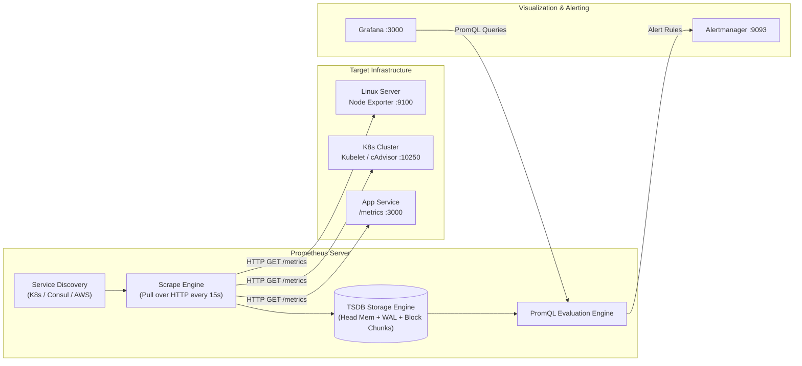

# Prometheus Architecture & Pull-Based Scraping

Prometheus ဆိုတာ metrics collection အတွက် cloud-native ရဲ့ de facto standard တစ်ခုဖြစ်ပြီး၊ မူလက SoundCloud မှာ စတင်ဖန်တီးခဲ့တာဖြစ်ပြီး လက်ရှိမှာတော့ CNCF project တစ်ခုအဖြစ် အောင်မြင်စွာ ရပ်တည်နေပါပြီ။



---

## Push ထက် ဘာကြောင့် Pull ကို သုံးတာလဲ?

Metrics တွေကို outward push လုပ်တဲ့ traditional agents တွေ (ဥပမာ- Datadog သို့မဟုတ် CloudWatch) နဲ့ မတူဘဲ Prometheus က HTTP ကနေတစ်ဆင့် metrics တွေကို **pull (scrape)** လုပ်ပါတယ် -

1. **Centralized Rate Control**: Target server တွေ overload ဖြစ်မသွားအောင် ဘယ်အချိန်မှာ ဘယ်လောက် அடிக்கடி scrape လုပ်ရမယ်ဆိုတာကို server ကပဲ တိုက်ရိုက်ဆုံးဖြတ်ပါတယ်။
2. **Built-In Liveness Detection**: Prometheus က endpoint တစ်ခုကို scrape လုပ်ဖို့ ပျက်ကွက်ခဲ့ရင် `up{instance="..."} = 0` ဆိုပြီး ချက်ချင်း record လုပ်ပါတယ်။ Dead ဖြစ်သွားတဲ့ server ဆီကနေ failure alert ပို့ပေးတာကို စောင့်နေစရာမလိုဘဲ target သေသွားပြီဆိုတာကို ချက်ချင်းသိနိုင်ပါတယ်။
3. **Multiple Scrapers**: Application configuration ကို ပြောင်းလဲစရာမလိုဘဲ Staging နဲ့ monitoring clusters တွေက application တစ်ခုတည်းကိုပဲ အတူတူ scrape လုပ်နိုင်ပါတယ်။

---

## TSDB Internal Storage Engine

Prometheus က time-series data တွေကို specialized append-only engine ကို သုံးပြီး သိမ်းဆည်းပါတယ်-
- **Head Chunk**: Recent samples တွေကို memory မှာ buffer လုပ်ထားပြီး process crash တာတွေ မဖြစ်အောင် disk ပေါ်က **Write-Ahead Log (WAL)** ဆီကို append လုပ်ပေးပါတယ်။
- **Compacted Blocks**: ၂ နာရီတစ်ကြိမ်, memory chunks တွေကို chunks directory, index နဲ့ metadata တွေပါဝင်တဲ့ 2-hour disk blocks အဖြစ် compacted လုပ်ပါတယ်။

```
/data/prometheus/
├── 01HMG7VZ8X... (2-hour block)
│   ├── chunks/000001
│   ├── index
│   └── meta.json
├── wal/
└── queries.active
```

---

## Hands-On: Production `prometheus.yml` Configuration

Global settings, alert rules နဲ့ target scrape jobs တွေပါဝင်တဲ့ production configuration file တစ်ခုကို ရေးကြည့်ရအောင် -

```yaml
# prometheus.yml
global:
  scrape_interval: 15s     # Scrape targets every 15 seconds
  evaluation_interval: 15s # Evaluate alert rules every 15 seconds
  scrape_timeout: 10s      # Timeout if target takes longer than 10s

# Alertmanager configuration
alerting:
  alertmanagers:
    - static_configs:
        - targets: ["alertmanager:9093"]

# Rule files to load
rule_files:
  - "/etc/prometheus/alert_rules.yml"

# Scrape targets
scrape_configs:
  # 1. Prometheus self-monitoring
  - job_name: "prometheus"
    static_configs:
      - targets: ["localhost:9090"]

  # 2. Host Linux metrics
  - job_name: "node_exporter"
    scrape_interval: 10s
    static_configs:
      - targets: ["node-exporter:9100"]

  # 3. Docker container metrics
  - job_name: "cadvisor"
    static_configs:
      - targets: ["cadvisor:8080"]

  # 4. Production Application API
  - job_name: "nextjs_app"
    metrics_path: "/api/metrics"
    static_configs:
      - targets: ["app:3000"]
        labels:
          environment: "production"
          tier: "frontend"
```

---

## Docker Compose ဖြင့် Monitoring Stack ကို Run ခြင်း

`docker-compose.yml` ဖိုင်တစ်ခုကို တည်ဆောက်ပါ -

```yaml
version: "3.8"

services:
  prometheus:
    image: prom/prometheus:v2.52.0
    container_name: prometheus
    restart: unless-stopped
    command:
      - "--config.file=/etc/prometheus/prometheus.yml"
      - "--storage.tsdb.path=/prometheus"
      - "--storage.tsdb.retention.time=30d"
      - "--web.enable-lifecycle"
    ports:
      - "9090:9090"
    volumes:
      - ./prometheus.yml:/etc/prometheus/prometheus.yml:ro
      - prometheus_data:/prometheus

volumes:
  prometheus_data:
```

Prometheus ကို စတင် run ပါ -
```bash
docker compose up -d
```

Browser ကိုဖွင့်ပြီး `http://localhost:9090` သို့သွားပါ, Endpoint အားလုံး `UP` state မှာ ရှိမရှိ စစ်ဆေးရန် **Status -> Targets** ကို ဝင်ရောက်ကြည့်ရှုပါ!