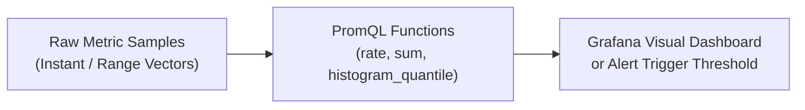
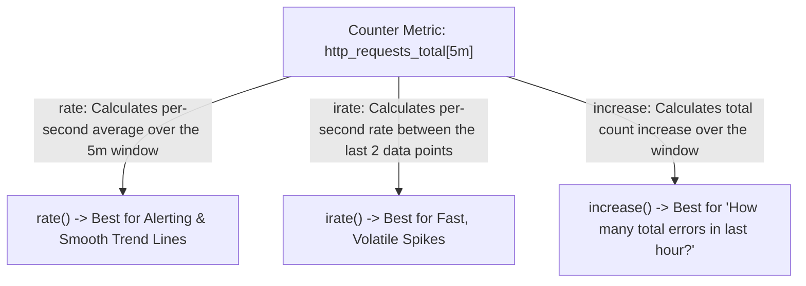

# PromQL Mastery: Rates, Histograms, and Quantiles

**PromQL (Prometheus Query Language)** ဆိုတာကတော့ time-series data တွေပေါ်မှာ real-time trend တွေ slice လုပ်ဖို့၊ aggregate လုပ်ဖို့နဲ့ calculate လုပ်ဖို့အတွက် အသုံးချတဲ့ domain-specific query language တစ်ခု ဖြစ်ပါတယ်။



---

## Metric Types အဓိက ၄ မျိုး

1. **Counter**: တဖြည်းဖြည်း တိုးလာတဲ့ metric တစ်မျိုး ဖြစ်ပြီး တိုးတာကနေ restart လုပ်လိုက်ရင် သုည (zero) ကို ပြန်ကျသွားတတ်ပါတယ် (ဥပမာ - `http_requests_total`, `errors_total`)။
2. **Gauge**: အတက်အကျ အမျိုးမျိုး ဖြစ်နိုင်တဲ့ တန်ဖိုး တစ်ခုပါ (ဥပမာ - `node_memory_MemAvailable_bytes`, `cpu_temperature`)။
3. **Histogram**: configurable bucket တွေထဲမှာ observation တွေကို sample လုပ်ပေးပါတယ် (ဥပမာ - `http_request_duration_seconds_bucket`)။
4. **Summary**: Histogram နဲ့ ဆင်တူပေမဲ့ client-side မှာ percentiles တွေကို calculate လုပ်ပေးပါတယ်။

---

## Instant Vectors vs. Range Vectors

- **Instant Vector**: timestamp တစ်ခုတည်းမှာရှိတဲ့ time series တစ်ခုချင်းစီအတွက် sample တစ်ခုစီ ပါဝင်တဲ့ time series အစုအဝေး တစ်ခု ဖြစ်ပါတယ်။
  ```promql
  http_requests_total{status="200"}
  ```
- **Range Vector**: အချိန်ကာလ တစ်ခုအတွင်းမှာရှိတဲ့ sample range တွေ ပါဝင်တဲ့ time series အစုအဝေး တစ်ခု ဖြစ်ပါတယ်။
  ```promql
  http_requests_total{status="200"}[5m]
  ```

> [!IMPORTANT]
> Range vector တစ်ခုကို **တိုက်ရိုက် graph ဆွဲလို့ မရပါဘူး**။ Range vector ကို graphing အတွက် instant vector အဖြစ် ပြောင်းလဲဖို့ rate ဒါမှမဟုတ် aggregation function တစ်ခုခုကို (ဥပမာ - `rate()`, `avg_over_time()`, ဒါမှမဟုတ် `count_over_time()`) သုံးပေးရပါမယ်။

---

## `rate()` vs `irate()` vs `increase()`

Counter တွေနဲ့ အလုပ်လုပ်တဲ့အခါ မှန်ကန်တဲ့ function ကို ရွေးချယ်ဖို့က အရမ်းအရေးကြီးပါတယ်-



### ဥပမာ-
```promql
# Rate of 5xx errors per second over last 5 minutes
rate(http_requests_total{status=~"5.."}[5m])

# Total number of 5xx errors in the last 1 hour
increase(http_requests_total{status=~"5.."}[1h])
```

---

## `histogram_quantile()` ဖြင့် Percentiles များကို Calculate လုပ်ခြင်း

Engineering မှာ average တွေကို အယုံအကြည်လွန်ဖို့ မကောင်းပါဘူး။ ဥပမာ- user ၉၉ ယောက်က latency 10ms ကို ခံစားရပြီး user ၁ ယောက်က latency 30,000ms ကို ခံစားရတယ်ဆိုရင် average က ~310ms ဖြစ်သွားပါမယ်။ အဲ့ဒီ user ကြုံတွေ့ရတဲ့ critical outage ကို ခင်ဗျား လွတ်သွားပါလိမ့်မယ်။

**Percentiles** တွေက real user experience ကို ဖော်ပြပေးပါတယ်-
- **p50 (Median)**: user တွေရဲ့ 50% က ဒီ latency ဒါမှမဟုတ် အဲဒီထက် ပိုမြန်တာကို ခံစားကြရပါတယ်။
- **p95**: user တွေရဲ့ 95% က ဒီ latency ဒါမှမဟုတ် အဲဒီထက် ပိုမြန်တာကို ခံစားကြရပါတယ်။
- **p99**: user တွေရဲ့ 99% က ဒီ latency ဒါမှမဟုတ် အဲဒီထက် ပိုမြန်တာကို ခံစားကြရပါတယ် (tail latency တွေကို ဖမ်းမိစေပါတယ်)။

```promql
# Calculate 99th percentile request latency per service over last 5 minutes:
histogram_quantile(
  0.99,
  sum(rate(http_request_duration_seconds_bucket[5m])) by (le, service)
)
```

---

## Production အတွက် PromQL Cheat-Sheet Queries ၁၀ ခု

### 1. Nodes တွေတစ်ခွင် CPU Usage Percentage
```promql
100 - (avg by (instance) (rate(node_cpu_seconds_total{mode="idle"}[5m])) * 100)
```

### 2. Available Memory Percentage
```promql
(node_memory_MemAvailable_bytes / node_memory_MemTotal_bytes) * 100
```

### 3. Disk Space Usage Percentage
```promql
100 - ((node_filesystem_avail_bytes{mountpoint="/"} / node_filesystem_size_bytes{mountpoint="/"}) * 100)
```

### 4. HTTP Error Rate Percentage (5xx နှင့် Total နှိုင်းယှဉ်ချက်)
```promql
(sum(rate(http_requests_total{status=~"5.."}[5m])) / sum(rate(http_requests_total[5m]))) * 100
```

### 5. Network Receive Bandwidth (Megabits / sec)
```promql
sum(rate(node_network_receive_bytes_total{device!~"lo|docker.*|veth.*"}[5m])) by (instance) * 8 / 1000000
```

### 6. Memory အများဆုံး စားသုံးနေတဲ့ Top 5 Containers တွေ
```promql
topk(5, sum(container_memory_working_set_bytes{name!=""}) by (name))
```

### 7. Container CPU Throttling Rate
```promql
rate(container_cpu_cfs_throttled_periods_total[5m]) / rate(container_cpu_cfs_periods_total[5m]) * 100
```

### 8. Target Down Alert Condition
```promql
up == 0
```