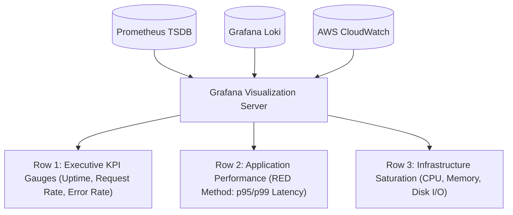
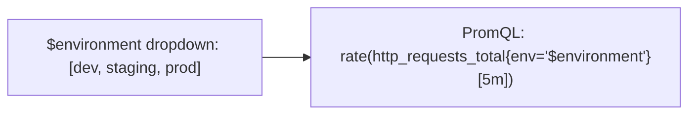

# Designing High-Impact Dashboards in Grafana

Grafana ဆိုတာ ခေတ်မီ cloud observability ရဲ့ visual layer ဖြစ်ပါတယ်။ ရಿಯယ်လ်တိုင်း interactive ဖြစ်တဲ့ engineering dashboards တွေ ဖန်တီးဖို့ data sources မျိုးစုံ (Prometheus, Loki, PostgreSQL, Elasticsearch) နဲ့ ချိတ်ဆက်ပေးပါတယ်။



---

## Principles of Production Dashboard Design

1. **Hierarchy Matters (Top-to-Bottom Flow)**:
   - **Top**: High-level status gauges နဲ့ SLA/SLO compliance (ဘယ် business က ကျန်းမာနေလဲ?)။
   - **Middle**: Service-level Golden Signals (Rate, Errors, Latency)။
   - **Bottom**: Low-level infrastructure metrics (disk IOPS, network drops, individual pod memory)။
2. **Standardize Visual Colors**:
   - Green: Normal / Healthy။
   - Yellow / Orange: Warning threshold (ဥပမာ- Memory > 75%)။
   - Red: Critical SLA breach (ဥပမာ- 5xx Error Rate > 1%)။
3. **Use Template Variables**: Dashboard panel တစ်ခုမှာ instance IP ဒါမှမဟုတ် container name ကို hardcode ဘယ်တော့မှ မလုပ်ပါနဲ့။

---

## Dynamic Dashboard Variables

Template variables တွေကို သုံးပြီး dropdown selectors တွေကနေတဆင့် servers ဒါမှမဟုတ် microservices ၁,၀၀၀ အတွက် dashboard တစ်ခုတည်းကိုပဲ အသုံးပြုနိုင်ပါတယ်-



### Creating a Dynamic Variable in Grafana:
1. **Dashboard Settings -> Variables -> Add Variable** ကို သွားပါ။
2. **Name**: `instance`
3. **Type**: `Query`
4. **Data Source**: `Prometheus`
5. **Query**:
   ```promql
   label_values(node_cpu_seconds_total, instance)
   ```

အခုဆိုရင် panel တိုင်းက သူတို့ရဲ့ PromQL query ထဲမှာ `$instance` ကို reference လုပ်လို့ရပါပြီ။

---

## Provisioning Dashboards as Code

Production dashboards တွေကို Grafana UI ထဲမှာ ဝင်နှိပ်ပြီး manual ဘယ်တော့မှ configure မလုပ်ပါနဲ့။ Server ပျက်သွားရင် dashboard တွေအားလုံး ဆုံးရှုံးသွားပါလိမ့်မယ်။

အဲ့ဒီအစား **Grafana Provisioning** ကို သုံးပါ-

### 1. Datasource Provisioning (`/etc/grafana/provisioning/datasources/datasources.yml`)
```yaml
apiVersion: 1

datasources:
  - name: Prometheus
    type: prometheus
    access: proxy
    url: http://prometheus:9090
    isDefault: true
    jsonData:
      timeInterval: 15s

  - name: Loki
    type: loki
    access: proxy
    url: http://loki:3100
```

### 2. Dashboard Provisioning (`/etc/grafana/provisioning/dashboards/dashboards.yml`)
```yaml
apiVersion: 1

providers:
  - name: "DevOps Production Dashboards"
    orgId: 1
    folder: "Production"
    type: file
    disableDeletion: false
    editable: true
    options:
      path: /var/lib/grafana/dashboards
```

আপনার JSON dashboards တွေကို `/var/lib/grafana/dashboards/*.json` ထဲကို export လုပ်ပြီး Git မှာ commit တင်ထားပါ။ Container boot တက်လာတဲ့အခါ Grafana က အဲ့ဒါတွေကို automatic load လုပ်ပေးပါလိမ့်မယ်။