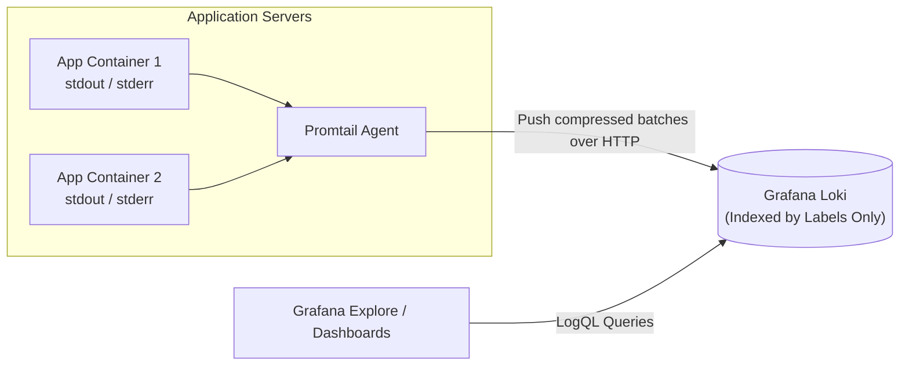

# Centralized Container Logging with Loki & Promtail

Traditional logging architecture တွေမှာ (ဥပမာ- Elasticsearch / ELK လိုမျိုး) log aggregator တွေဟာ log payload တစ်ခုချင်းစီရဲ့ စကားလုံးတိုင်းကို inverted index အဖြစ် index လုပ်ကြပါတယ်။ ဒါဟာ ကြီးမားတဲ့ memory ပမာဏ၊ ကြီးမားတဲ့ NVMe storage နဲ့ ဈေးကြီးတဲ့ CPU cluster တွေ အများကြီး လိုအပ်ပါတယ်။

**Grafana Loki** ကတော့ လုံးဝ ကွဲပြားခြားနားတဲ့ ခြေလှမ်းတစ်ရပ်ကို အသုံးပြုပါတယ်- **metadata labels တွေကိုပဲ index လုပ်ပါတယ်** (ဥပမာ- `app="nginx"`, `env="production"` လိုမျိုး) ပြီးတော့ compression လုပ်ထားတဲ့ raw log stream chunk တွေကိုတော့ ဈေးသက်သာတဲ့ object storage တွေမှာ (AWS S3 ဒါမှမဟုတ် MinIO လိုမျိုး) သိမ်းဆည်းပါတယ်။



---

## LogQL: The Log Query Language

LogQL က log stream တွေကို real time မှာ filter လုပ်ဖို့နဲ့ transform လုပ်ဖို့ ခွင့်ပြုပါတယ်:

### 1. Stream Selectors (Targeting Specific Logs)
```logql
# Get all logs from the production checkout microservice
{app="checkout-service", environment="production"}
```

### 2. Line Filter Expressions
```logql
# Filter logs containing "error" (case-insensitive)
{app="checkout-service"} |= "error"

# Filter logs containing "database connection" but NOT containing "ping"
{app="checkout-service"} |= "database connection" != "ping"

# Regex match for 400 or 500 HTTP status codes
{app="checkout-service"} |~ "HTTP/1.1 (4|5)[0-9]{2}"
```

### 3. Parsing JSON Logs & Formatting
```logql
# Automatically parse JSON fields and filter where duration > 5000ms
{app="checkout-service"} | json | response_time_ms > 5000 | line_format "{{.timestamp}} [{{.level}}] user={{.user_id}} took {{.response_time_ms}}ms"
```

### 4. Metrics from Logs (Converting Logs to Graphs!)
```logql
# Calculate error frequency rate per second over the last 5 minutes:
sum(rate({app="checkout-service"} |= "ERROR" [5m])) by (service)
```

---

## Complete Promtail Configuration

`promtail-config.yml` ကို ဖန်တီးပါ:

```yaml
server:
  http_listen_port: 9080
  grpc_listen_port: 0

positions:
  filename: /tmp/positions.yaml

clients:
  - url: http://loki:3100/loki/api/v1/push

scrape_configs:
  - job_name: docker_containers
    static_configs:
      - targets:
          - localhost
        labels:
          job: docker
          __path__: /var/lib/docker/containers/*/*-json.log

    # Extract container name and image from Docker metadata
    pipeline_stages:
      - json:
          expressions:
            log: log
            stream: stream
            time: time
      - output:
          source: log
```