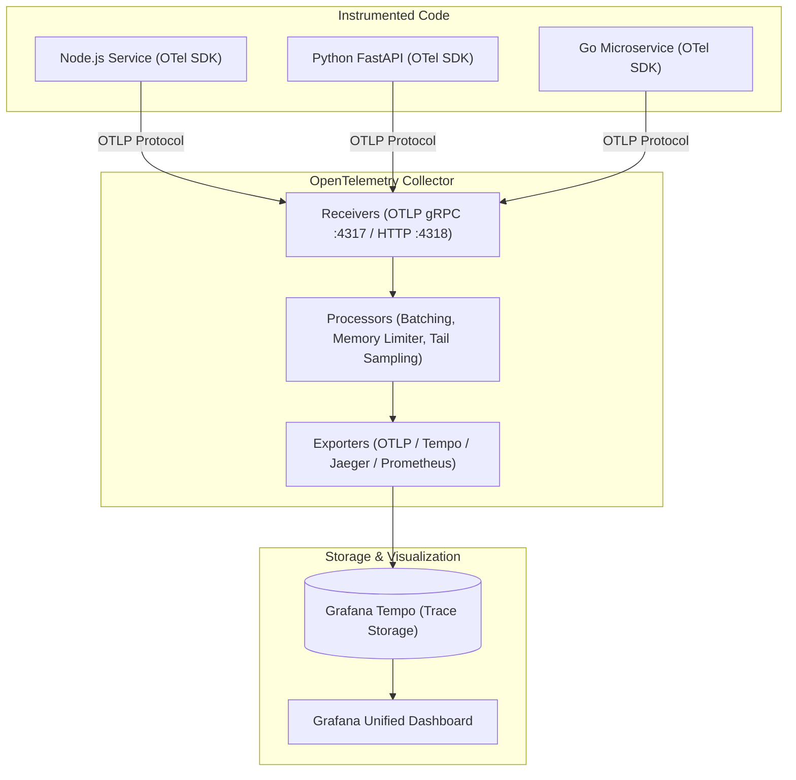

# Distributed Tracing Essentials with OpenTelemetry

Application တစ်ခုကို HTTP နဲ့ gRPC တဆင့် အချင်းချင်း ချိတ်ဆက်ထားတဲ့ microservices ၂၀ ခုနဲ့ ပိုင်းခြားထားတဲ့အခა၊ User ရဲ့ တစ်ချက် နှိပ်လိုက်မှု (click) တစ်ခုတည်းကတင် databases, caches နဲ့ APIs ၈ ခုလောက်ထိ ဖြတ်သန်းသွားနိုင်ပါတယ်။

တကယ်လို့ အဲ့ဒီ request က 4.8 စက္ကန့် ကြာသွားတယ်ဆိုရင် metrics နဲ့ logs တွေသုံးပြီး ဘယ် specific call က နှေးကွေးစေလဲဆိုတာကို အလွယ်တကူ ရှာမတွေ့နိုင်ပါဘူး။ **Distributed Tracing** က distributed system တစ်ခုလုံးထဲမှာရှိတဲ့ request တိုင်းရဲ့ end-to-end ခရီးစဥ်ကို ခြေရာခံပေးပါတယ်။

```mermaid
gantt
    title Distributed Trace Waterfall (#trace-id-9a1f2b) - Total: 215ms
    dateFormat X
    axisFormat %s ms

    section Frontend
    GET /api/checkout            :active, 0, 215
    section Auth Service
    JWT Token Validation         :crit, 5, 25
    section Cart API
    Fetch User Cart Items        : 30, 70
    section Payment Gateway
    Stripe API HTTP Call         :crit, 75, 195
    section Postgres DB
    INSERT order_record          : 195, 212
```



---

## Core Distributed Tracing Terminology

1. **Trace**: System ထဲကို ဝင်လာတဲ့ transaction တစ်ခုတည်းရဲ့ complete ဖြစ်တဲ့ end-to-end ခရီးစဥ် (spans တွေနဲ့ ပေါင်းစပ်ဖွဲ့စည်းထားပါတယ်)။
2. **Span**: စတင်တဲ့အချိန် (start time)၊ ပြီးဆုံးတဲ့အချိန် (end time)၊ နာမည်၊ status၊ tags နဲ့ events တွေပါဝင်တဲ့ အလုပ်ရဲ့ unit တစ်ခု (ဥပမာ- SQL query ဒါမှမဟုတ် HTTP call တစ်ခု)။
3. **Trace ID**: ခြုံငုံထားတဲ့ trace ကို ခွဲခြားသိရှိနိုင်ဖို့အတွက် တစ်ကမ္ဘာလုံးမှာ unique ဖြစ်တဲ့ 128-bit hex string (ဥပမာ- `4bf92f3577b34da6a3ce929d0e0e4736`)။
4. **Span ID**: trace ထဲမှာရှိတဲ့ သီးသန့် operation တစ်ခုချင်းစီကို ခွဲခြားပေးတဲ့ unique ဖြစ်တဲ့ 64-bit hex string။
5. **Context Propagation**: နောက်ဆက်တွဲ service တွေက trace တစ်ခုတည်းကို ဆက်လက်လုပ်ဆောင်နိုင်ဖို့အတွက် `traceparent` HTTP header (`00-4bf92f...-00`) ကို service နယ်နိမိတ်တွေကြားမှာ ထည့်သွင်းပေးတာ (inject လုပ်တာ)။

---

## The OpenTelemetry (OTel) Architecture

OpenTelemetry (CNCF) ဆိုတာကတော့ telemetry တွေကို ကောက်ယူဖို့အတွက် vendor-neutral ဖြစ်တဲ့ standard တစ်ခု ဖြစ်ပါတယ်။



---

## Hands-On: Auto-Instrumenting a Node.js App with OpenTelemetry

Distributed traces တွေ ရဖို့အတွက် ကိုယ့်ရဲ့ code တွေကို အစကနေ ပြန်ရေးစရာ မလိုပါဘူး။ OpenTelemetry က နာမည်ကြီး frameworks တွေ (Express, Next.js, HTTP, PostgreSQL, Redis) အတွက် automatic instrumentation ကို ထောက်ပံ့ပေးထားပါတယ်။

### 1. Install OTel Packages
```bash
npm install @opentelemetry/sdk-node   @opentelemetry/auto-instrumentations-node   @opentelemetry/exporter-trace-otlp-grpc
```

### 2. Create `tracer.js`
```javascript
// tracer.js
const { NodeSDK } = require('@opentelemetry/sdk-node');
const { getNodeAutoInstrumentations } = require('@opentelemetry/auto-instrumentations-node');
const { OTLPTraceExporter } = require('@opentelemetry/exporter-trace-otlp-grpc');

const sdk = new NodeSDK({
  traceExporter: new OTLPTraceExporter({
    url: 'http://otel-collector:4317', // OpenTelemetry Collector endpoint
  }),
  instrumentations: [getNodeAutoInstrumentations()],
});

sdk.start();
console.log('OpenTelemetry Tracing initialized successfully!');
```

### 3. Run with Node Pre-Load
```bash
node --require ./tracer.js server.js
```

အခုဆိုရင် ဝင်လာသမျှ HTTP request တွေ၊ ထွက်သွားတဲ့ database query တွေနဲ့ third-party API call တိုင်းဟာ application code ကို တစ်ချက်မှ ပြောင်းလဲစရာမလိုဘဲ automatically trace လုပ်သွားမှာ ဖြစ်ပါတယ်။