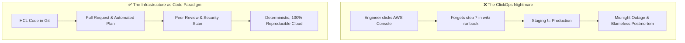
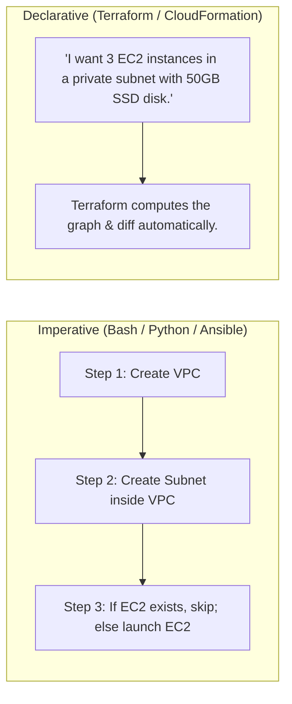
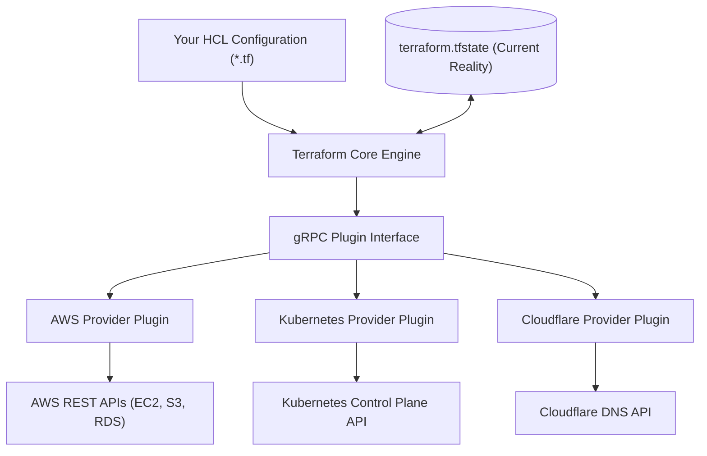
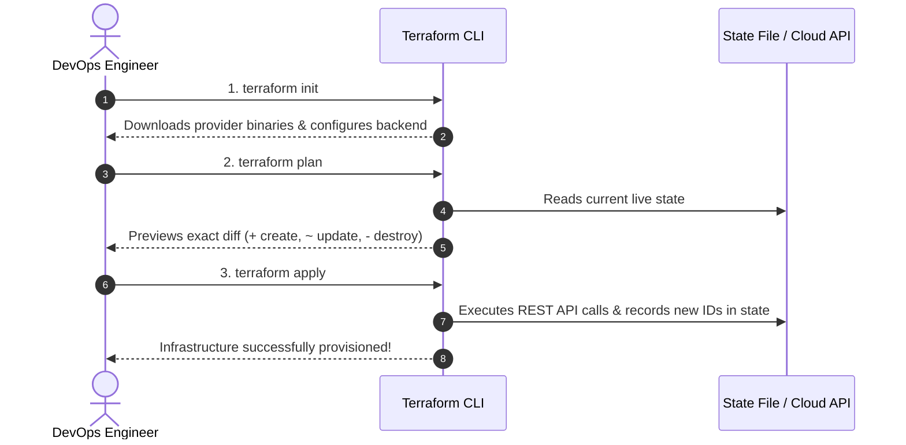

# Why Infrastructure as Code & Terraform Architecture

Infrastructure as Code (IaC) မပေါ်ခင်တုန်းက servers တွေ၊ VPC networks တွေ၊ databases တွေနဲ့ load balancers တွေ deploy လုပ်ဖို့ဆိုရင် web consoles တွေကနေ တစ်ဆင့် manual လုပ်ခဲ့ကြရပါတယ် — ဒီလို လုပ်ဆောင်ပုံကို industry ထဲမှာ **ClickOps** လို့ ခေါ်ကြပါတယ်။

ClickOps က weekend side-project လေးတွေ စမ်းလုပ်ဖို့အတွက်တော့ အဆင်ပြေပေမဲ့ production engineering မှာတော့ လုံးဝ သုံးလို့မရပါဘူး။



---

## ClickOps ရဲ့ ဆိုးကျိုး ၄ ချက် (The 4 Disasters of ClickOps)

1. **Configuration Drift**: ၆ လလောက် ကြာလာတဲ့အခါ engineers တွေက security groups တွေကို ဝင်ပြင်တာ၊ instances တွေရဲ့ size တွေကို ချိန်တာ၊ environment variables တွေကို AWS Console ကနေ manual တွေ လိုက်ပြောင်းကြပါတယ်။ ပြဿနာ တစ်ခုခု တက်လာပြီဆိုရင် စနစ်တစ်ခုလုံးကို ခြေကနေစပြီး ဘယ်လိုပြန်ဆောက်ရမှန်း ဘယ်သူမှ မသိတော့ပါဘူး။
2. **Zero Audit Trail**: ည ၃ နာရီလောက်မှာ firewall rule တစ်ခုခုထဲမှာ `22` (SSH) port ကို `0.0.0.0/0` ဆီကို လိုက်ဖွင့်မိတယ်ဆိုပါစို့။ ဘယ်သူ့ဆီကမှ Git commit log လည်း မရှိဘူး၊ pull request approval လည်း မရှိဘူး၊ ဘာကြောင့် လုပ်တယ်ဆိုတဲ့ အကြောင်းပြချက်လည်း မှတ်တမ်းတင်ထားတာ မရှိပါဘူး။
3. **Environment Inconsistency**: "Dev မှာတော့ အလုပ်လုပ်တယ်၊ ဒါပေမဲ့ Prod မှာ ကျတော့ error တက်နေတယ်"။ ဘာလို့လဲဆိုတော့ Dev ကို ဇန်နဝါရီလတုန်းက Alice က configure လုပ်ခဲ့တာဖြစ်ပြီး Prod ကိုတော့ သြဂုတ်လမှာ Bob က subnet masks တွေနဲ့ disk IOPS တွေ မတူတာတွေနဲ့ configure လုပ်ခဲ့လို့ပါပဲ။
4. **Slow Disaster Recovery**: region အများကြီးပါတဲ့ cloud infrastructure ကြီး တစ်ခုလုံးကို manual ပြန်ဆောက်ဖို့ဆိုရင် ရက်ပေါင်းများစွာ ကြာတတ်ပါတယ်။ IaC ကိုသာ သုံးမယ်ဆိုရင်တော့ region တစ်ခုလုံးကို command တစ်ခုတည်းနဲ့ ပြန်ဆောက်နိုင်ပါတယ်: `terraform apply`။

---

## Imperative vs. Declarative: အဓိက ကွာခြားချက်

Infrastructure တွေကို automate လုပ်တဲ့အခា သုံးတဲ့ tools တွေမှာ အခြေခံအားဖြင့် paradigm နှစ်ခု ရှိပါတယ်:



| Feature | Imperative (ဥပမာ - Bash, AWS CLI) | Declarative (Terraform) |
| :--- | :--- | :--- |
| **Focus** | ဘယ်လို လုပ်ရမလဲ (step-by-step commands တွေ) | နောက်ဆုံး ထွက်လာမယ့် result က ဘယ်လိုပုံစံ ဖြစ်ရမလဲ |
| **Idempotency** | လုပ်ရခက်တယ်၊ resource တိုင်းအတွက် check လုပ်တဲ့ code တွေ လိုက်ရေးရတယ် | ပါပြီးသားဖြစ်တယ်၊ ၁၀ ခါ run ရင်တောင် state က အတူတူပဲ ထွက်တယ် |
| **State Awareness** | မရှိဘူး (ရှိပြီးသား resources တွေကို scripts တွေက မသိဘူး) | အပြည့်အဝ ရှိတယ် (state file ကို single source of truth အနေနဲ့ ထိန်းသိမ်းပေးတယ်) |
| **Deletions** | delete လုပ်တဲ့ script သပ်သပ် အတိအကျ ရေးပေးရတယ် | code block ကိုပဲ ဖြုတ်လိုက်ပြီး apply run လိုက်ရုံပဲ |

---

## Terraform ရဲ့ အတွင်းပိုင်း Architecture

Terraform ကို HashiCorp ကနေ compiled Go binary တစ်ခုအနေနဲ့ တည်ဆောက်ထားပါတယ်။ ဒါဟာ အဓိက component နှစ်ခုနဲ့ ဖွဲ့စည်းထားပါတယ်:



### 1. Terraform Core
Core engine ကတော့ cloud-agnostic ဖြစ်ပါတယ်။ ဒါဟာ ခင်ဗျားရဲ့ `.tf` configuration files တွေကို ဖတ်တယ်၊ resources တွေ အားလုံးရဲ့ **Directed Acyclic Graph (DAG)** တစ်ခုကို တည်ဆောက်ပေးတယ်၊ ခင်ဗျားရဲ့ code နဲ့ **State File** ကို တိုက်ဆိုင်စစ်ဆေးပြီး mathematical diff (Plan) ကို တွက်ချက်ပေးပါတယ်။

### 2. Providers (Plugins)
Providers တွေကတော့ cloud platforms တွေရဲ့ API တွေ (AWS, GCP, Azure, DigitalOcean, GitHub, Kubernetes, Docker) နဲ့ သီးသန့် ချိတ်ဆက်ပေးတဲ့ binary plugins တွေ ဖြစ်ပါတယ်။ Terraform က `terraform init` လုပ်တဲ့အခါ providers တွေကို automatic download လုပ်ပေးပါတယ်။

---

## Terraform Workflow အဓိက အဆင့်များ

Terraform ကို အသုံးပြုတဲ့အခါတိုင်း အဆင့် ၄ ဆင့်ပါတဲ့ lifecycle အတိုင်း စနစ်တကျ လုပ်ဆောင်ရပါတယ်။



---

## Terraform ကို သွင်းခြင်းနှင့် စစ်ဆေးခြင်း (Installing and Verifying Terraform)

macOS ပေါ်မှာ (Homebrew သုံးပြီး):
```bash
brew tap hashicorp/tap
brew install hashicorp/tap/terraform
```

Ubuntu / Debian Linux ပေါ်မှာ:
```bash
sudo apt-get update && sudo apt-get install -y gnupg software-properties-common curl
curl -fsSL https://apt.releases.hashicorp.com/gpg | sudo gpg --dearmor -o /usr/share/keyrings/hashicorp-archive-keyring.gpg
echo "deb [signed-by=/usr/share/keyrings/hashicorp-archive-keyring.gpg] https://apt.releases.hashicorp.com $(lsb_release -cs) main" | sudo tee /etc/apt/sources.list.d/hashicorp.list
sudo apt-get update && sudo apt-get install terraform
```

installation ကို စစ်ဆေးပါ:
```bash
$ terraform version
Terraform v1.8.5
on linux_amd64
```

> [!TIP]
> အလုပ်ပိုတွင်စေဖို့ shell autocompletion ကို ဖွင့်ထားပါ:
> ```bash
> terraform -install-autocomplete
> ```
> Terminal ကို restart ချလိုက်ပါ၊ ဒါဆိုရင် commands တွေ၊ flags တွေနဲ့ resource names တွေကို `Tab` နှိပ်ရုံနဲ့ autocomplete လုပ်နိုင်သွားပါပြီ။