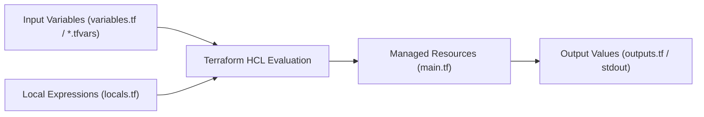

# Input Variables, Locals & Output Values

Resource block တွေထဲမှာ AMI IDs, IP ranges, instance sizes, ဒါမှမဟုတ် environment names လိုမျိုး value တွေကို တိုက်ရိုက် Hardcoding လုပ်တာက configuration တွေကို ပုံစံတကျ မဖြစ်စေဘဲ ပြုပြင်ထိန်းသိမ်းရ ခက်ခဲစေပါတယ်။

**DRY (Don't Repeat Yourself)** principle ကို လိုက်နာနိုင်ဖို့အတွက် Terraform မှာ **Input Variables**, **Locals**, နဲ့ **Output Values** တွေကို ထည့်သွင်းပေးထားပါတယ်။



---

## 1. Input Variables (`variables.tf`)

Variables တွေက underlying HCL resource declaration တွေကို တိုက်ရိုက် မပြင်ဆင်ဘဲနဲ့ infrastructure ရဲ့ behavior ကို customize လုပ်ဖို့အတွက် consumers တွေကို ခွင့်ပြုပေးပါတယ်။

### Full Variable Declaration Syntax:
```hcl
# variables.tf

variable "environment" {
  type        = string
  description = "Target deployment environment (dev, staging, or prod)"
  default     = "dev"

  # Custom validation rules enforce guardrails before applying!
  validation {
    condition     = contains(["dev", "staging", "prod"], var.environment)
    error_message = "The environment variable must be one of: 'dev', 'staging', 'prod'."
  }
}

variable "instance_count" {
  type        = number
  description = "Number of worker instances to provision"
  default     = 2

  validation {
    condition     = var.instance_count >= 1 && var.instance_count <= 20
    error_message = "Worker instances must be between 1 and 20."
  }
}

variable "enable_monitoring" {
  type        = bool
  description = "Enable detailed CloudWatch metrics"
  default     = true
}

variable "allowed_ip_cidrs" {
  type        = list(string)
  description = "List of permitted ingress CIDR blocks"
  default     = ["10.0.0.0/16"]
}

variable "database_credentials" {
  type = object({
    username = string
    password = string
    port     = number
  })
  description = "Database master credentials"
  sensitive   = true # Prevents password from being printed to CLI output!
}
```

---

## 2. Setting Variable Values in Production

Terraform က variable value တွေကို သီးသန့် precedence အစဉ်အတိုင်း ရှာဖွေပါတယ် (priority အမြင့်ဆုံးက နိုင်ပါတယ်):

1. **CLI Flag**: `terraform apply -var="environment=prod"`
2. **Environment Variables**: `export TF_VAR_environment=prod`
3. **Variable Definitions File**: `terraform.tfvars` ဒါမှမဟုတ် `terraform.tfvars.json`
4. **Auto-Loaded Files**: `*.auto.tfvars`
5. **Default Value**: `variable {}` block ထဲမှာ သတ်မှတ်ထားတာ

### Production `terraform.tfvars` Example:
```hcl
environment       = "staging"
instance_count    = 4
enable_monitoring = true
allowed_ip_cidrs  = ["10.20.0.0/16", "192.168.1.0/24"]

database_credentials = {
  username = "admin_user"
  password = "SuperSecretPassword2026!"
  port     = 5432
}
```

---

## 3. Local Values (`locals.tf`)

Variables တွေနဲ့ မတူတာက (variables တွေကို module ရဲ့ အပြင်ဘက်ကနေ ပို့ပေးရပါတယ်) **Locals** ဆိုတာကတော့ module ထဲမှာတင် တွက်ချက်ထားတဲ့ internal variables တွေ ဖြစ်ပါတယ်။ သူတို့က ထပ်ခါထပ်ခါ ဖြစ်နေတဲ့ ရှုပ်ထွေးတဲ့ expression တွေကို ရှောင်ရှားနိုင်စေပါတယ်။

```hcl
# locals.tf

locals {
  # Common name prefix
  name_prefix = "devops-${var.environment}"

  # Standard tags applied to every resource for billing and compliance
  common_tags = {
    Project     = "ZeroToHero"
    Environment = var.environment
    ManagedBy   = "Terraform"
    CostCenter  = "Engineering-101"
  }

  # Conditional sizing based on environment
  instance_type = var.environment == "prod" ? "m5.large" : "t3.micro"
}
```

### Referencing Locals in Resources:
```hcl
resource "aws_instance" "web_server" {
  count         = var.instance_count
  ami           = "ami-0c55b159cbfafe1f0"
  instance_type = local.instance_type

  tags = merge(
    local.common_tags,
    {
      Name = "${local.name_prefix}-worker-${count.index + 1}"
    }
  )
}
```

---

## 4. Output Values (`outputs.tf`)

Outputs တွေမှာ အဓိက ရည်ရွယ်ချက် ၂ ခု ရှိပါတယ်:
1. `terraform apply` လုပ်ပြီးသွားတဲ့အခါ terminal ပေါ်မှာ အရေးကြီးတဲ့ connection strings နဲ့ endpoints တွေကို ထုတ်ပြပေးပါတယ်။
2. တခြား modules တွေ ဒါမှမဟုတ် remote state ဖတ်တဲ့သူတွေကို value တွေ ပေါ်လာအောင် လုပ်ပေးပါတယ်။

```hcl
# outputs.tf

output "vpc_id" {
  value       = aws_vpc.main.id
  description = "The unique ID of the created VPC"
}

output "web_public_ips" {
  value       = aws_instance.web_server[*].public_ip
  description = "List of public IP addresses for all provisioned web servers"
}

output "database_endpoint" {
  value       = "postgres://${aws_db_instance.db.endpoint}/production"
  description = "Connection URI for database cluster"
  sensitive   = true # Hides connection string with password from plain terminal output!
}
```

Terminal ကနေ outputs တွေကို ဘယ်အချိန်မဆို query လုပ်လို့ရပါတယ်:
```bash
# View all outputs in JSON format
$ terraform output -json

# Query a specific output
$ terraform output web_public_ips
[
  "54.210.12.44",
  "54.210.12.45"
]
```

---

## 5. Loops and Collections: `for_each` vs `count`

ဆင်တူတဲ့ resource အများကြီးကို provision လုပ်တဲ့အခါ unique identifiers တွေ ပါတဲ့ resource တွေအတွက် `count` ထက် `for_each` ကို အမြဲတမ်း ပိုသုံးသင့်ပါတယ်:

```hcl
# Creating multiple IAM users using for_each with a set
variable "engineering_users" {
  type    = set(string)
  default = ["alice", "bob", "charlie"]
}

resource "aws_iam_user" "developers" {
  for_each = var.engineering_users
  name     = each.key

  tags = {
    Role = "Software Engineer"
  }
}
```

> [!WARNING]
> **ဘာကြောင့် `count` ထက် `for_each` က ပိုလုံခြုံရတာလဲ**: တကယ်လို့ `count` ကို သုံးပြီး list ထဲက ပထမဆုံး element ကို ဖျက်လိုက်မယ်ဆိုရင် Terraform က array indices တွေ ရွှေ့သွားတဲ့အတွက် (`[0]`, `[1]`, `[2]`) နောက်ဆက်တွဲ resource တိုင်းကို destroy လုပ်ပြီး ပြန်ဆောက်ပါလိမ့်မယ်။ `for_each` ကတော့ distinct string name နဲ့ resource တွေကို key လုပ်ပေးတဲ့အတွက်ကြောင့် တိုးတာနဲ့ ဖျက်တာတွေကို လုံးဝ လုံလုံခြုံခြုံ လုပ်ဆောင်နိုင်စေပါတယ်!