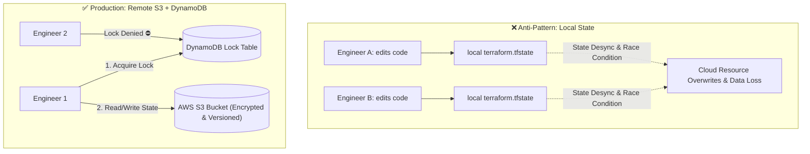

# Terraform State, Remote S3 Backend & State Locking

ဒီ **State File** (`terraform.tfstate`) ကတော့ Terraform မှာ အvery critical ဖြစ်ပြီး sensitive အletရဆုံး component ပဲ ဖြစ်ပါတယ်။ ဒါ မရှိရင် Terraform က HCL code နဲ့ real-world cloud resources ဘယ်ဟာနဲ့ ဘယ်ဟာ တွဲနေလဲဆိုတာကို သိနိုင်မှာ မဟုတ်ပါဘူး။



---

## `terraform.tfstate` ထဲမှာ ဘာတွေ ရှိနေလဲ?

State file ဆိုတာ JSON document တစ်ခု ဖြစ်ပြီး အောက်ပါတို့ ပါဝင်ပါတယ် -
1. **Resource ID Mappings**: `aws_instance.web` ကို real AWS ID `i-08a1b2c3d4e5f6789` နဲ့ တွဲပေးပါတယ်။
2. **Metadata & Dependencies**: ဘယ် resource က ဘယ်ဟာကို depend လုပ်ထားလဲဆိုတာကို track လုပ်ပါတယ်။
3. **Performance Cache**: Resource attributes တွေကို local မှာ cache လုပ်ထားပေးတဲ့အတွက် `terraform plan` လုပ်တဲ့အခါတိုင်း keystroke တိုင်းမှာ slow ဖြစ်တဲ့ API calls တွေကို ကြီးကြီးမားမား ခေါ်နေစရာ မလိုတော့ပါဘူး။
4. **Sensitive Data**: Database passwords၊ private keys နဲ့ API tokens တွေကို state file ထဲမှာ **plain text** အနေနဲ့ သိမ်းဆည်းထားပါတယ်။

---

## Step-by-Step: Production Remote Backend ကို AWS မှာ Provision လုပ်ခြင်း

AWS မှာ state ကို secure ဖြစ်ဖြစ် host လုပ်ဖို့ resource နှစ်ခု လိုအပ်ပါတယ် -
1. **An AWS S3 Bucket**: **Server-Side Encryption (SSE)** နဲ့ **Bucket Versioning** enable လုပ်ထားရပါမယ် (state corrupt ဖြစ်သွားရင် rollback လုပ်လို့ရအောင်ပါ။)
2. **An AWS DynamoDB Table**: Distributed state locking အတွက် `LockID` လို့ခေါ်တဲ့ primary key ပါရပါမယ်။

### Step 1: S3 Bucket နှင့် DynamoDB Table ကို Bootstrap လုပ်ခြင်း
Bootstrap file `bootstrap-backend.tf` ကို ဖန်တီးပါ -

```hcl
provider "aws" {
  region = "us-east-1"
}

# 1. Encrypted, versioned S3 bucket for state storage
resource "aws_s3_bucket" "terraform_state" {
  bucket        = "my-company-devops-tfstate-2026"
  force_destroy = false # Prevent accidental deletion!

  lifecycle {
    prevent_destroy = true
  }
}

resource "aws_s3_bucket_versioning" "state_versioning" {
  bucket = aws_s3_bucket.terraform_state.id
  versioning_configuration {
    status = "Enabled"
  }
}

resource "aws_s3_bucket_server_side_encryption_configuration" "state_encryption" {
  bucket = aws_s3_bucket.terraform_state.id

  rule {
    apply_server_side_encryption_by_default {
      sse_algorithm = "AES256"
    }
  }
}

resource "aws_s3_bucket_public_access_block" "block_public" {
  bucket = aws_s3_bucket.terraform_state.id

  block_public_acls       = true
  block_public_policy     = true
  ignore_public_acls      = true
  restrict_public_buckets = true
}

# 2. DynamoDB Table for Distributed State Locking
resource "aws_dynamodb_table" "terraform_locks" {
  name         = "terraform-state-locks"
  billing_mode = "PAY_PER_REQUEST"
  hash_key     = "LockID"

  attribute {
    name = "LockID"
    type = "S"
  }
}
```

ဒီ bootstrap configuration ကို apply လုပ်ပါ -
```bash
terraform init
terraform apply
```

---

## Step 2: Project ထဲတွင် Remote Backend ကို Config လုပ်ခြင်း

အခု main infrastructure project ထဲမှာ `backend.tf` ထဲက `backend "s3"` block ကို config လုပ်ပါ -

```hcl
# backend.tf
terraform {
  backend "s3" {
    bucket         = "my-company-devops-tfstate-2026"
    key            = "production/infrastructure/terraform.tfstate"
    region         = "us-east-1"
    dynamodb_table = "terraform-state-locks"
    encrypt        = true
  }
}
```

Migration ကို run ပါ -
```bash
$ terraform init -migrate-state

Do you want to copy existing state to the new backend?
  Enter a value: yes

Successfully configured the backend "s3"! Terraform will now
use this backend for all future state operations.
```

---

## State ကို Safe ဖြစ်ဖြစ် Inspect လုပ်ခြင်း & Manipulate လုပ်ခြင်း

`terraform.tfstate` ကို text editor နဲ့ လက်နဲ့ လုံးဝ သွားမပြင်ပါနဲ့! Built-in ဖြစ်တဲ့ CLI inspection commands တွေကိုပဲ အမြဲ သုံးပါ -

```bash
# 1. List all resources tracked by state
$ terraform state list
aws_vpc.production_vpc
aws_subnet.public_a
aws_instance.web_server[0]
aws_instance.web_server[1]

# 2. Inspect full attributes of a specific resource
$ terraform state show aws_vpc.production_vpc

# 3. Rename a resource without destroying and recreating it in AWS!
$ terraform state mv aws_instance.web_server[0] aws_instance.primary_web

# 4. Remove a resource from state without deleting it from AWS
$ terraform state rm aws_s3_bucket.legacy_logs
```

---

## Stale State Locks များကို ဖြေရှင်းခြင်း

Engineer တစ်ယောက်ရဲ့ laptop crash ဖြစ်သွားတာပဲဖြစ်ဖြစ်၊ `terraform apply` လုပ်နေတုန်း CI/CD job တစ်ခု திடန်း and ဖြစ်သွားတာပဲဖြစ်ဖြစ် ဖြစ်ခဲ့ရင် DynamoDB lock က active ဖြစ်ကျန်နေခဲ့တတ်ပါတယ် -

```bash
Error: Error acquiring the state lock: ConditionalCheckFailedException
Lock Info:
  ID:        e29a9978-5e8a-4467-93be-123456789abc
  Path:      my-company-devops-tfstate-2026/production/infrastructure/terraform.tfstate
  Operation: OperationTypeApply
  Who:       alice@macbook-pro.local
  Created:   2026-08-19 01:30:15 UTC
```

অন্য apply ဘာမှ မrunနေတော့ဘူးဆိုတာ သေချာ confirm လုပ်ပြီးရင် lock ကို safe ဖြစ်ဖြစ် ပြန် release လုပ်ချင်ရင် -
```bash
terraform force-unlock e29a9978-5e8a-4467-93be-123456789abc
```