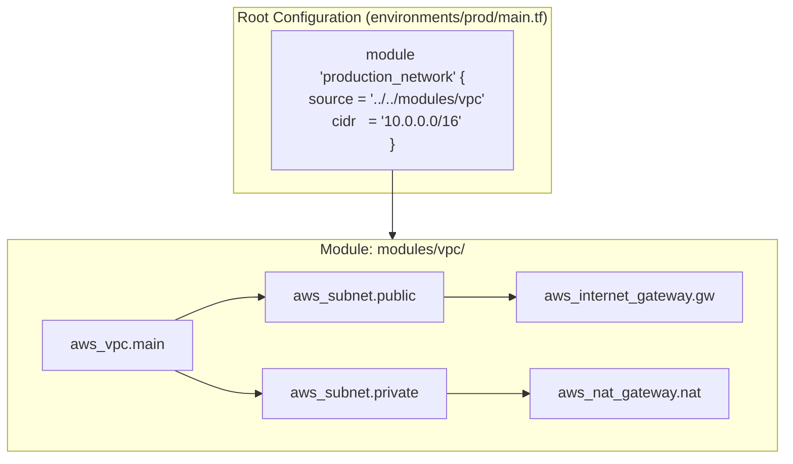

# Reusable ဖြစ်ပြီး Production-Grade ဖြစ်တဲ့ Infrastructure Modules များ ဖန်တီးခြင်း

**Terraform Module** ဆိုတာကတော့ တူတူသုံးကြတဲ့ resources တွေ အများကြီးကို တစ်နေရာတည်းမှာ စုစည်းထားတဲ့ container တစ်ခု ဖြစ်ပါတယ်။ ကိုယ့်ရဲ့ services 5 ခုလောက်မှာ တူညီတဲ့ VPC, Kubernetes cluster ဒါမှမဟုတ် database configuration တွေကို ထပ်ခါထပ်ခါ ရေးနေရပြီဆိုရင် ဒါတွေကို module တစ်ခုအနေနဲ့ ပုံစံထုတ် (package) လိုက်သင့်ပါတယ်။



---

## Standard Module File Structure

Clean ဖြစ်ပြီး production-grade ဖြစ်တဲ့ module repository တစ်ခုက ဒီလို structure အတိအကျအတိုင်း ရှိရပါမယ်။

```
modules/vpc_network/
├── README.md           # Documentation, inputs, and outputs table
├── main.tf             # Core resource declarations
├── variables.tf        # Input variable definitions with validations
├── outputs.tf          # Exported values (VPC ID, subnet IDs)
└── versions.tf         # Minimum required Terraform and provider versions
```

---

## Complete Production VPC Module တစ်ခု တည်ဆောက်ခြင်း

လက်တွေ့သုံးလို့ရမယ့် reusable VPC module တစ်ခုကို အတူတူ ရေးကြည့်ရအောင်။

### 1. `modules/vpc_network/variables.tf`
```hcl
variable "vpc_cidr" {
  type        = string
  description = "The CIDR block for the VPC"
  default     = "10.0.0.0/16"
}

variable "availability_zones" {
  type        = list(string)
  description = "List of AWS availability zones to deploy subnets into"
}

variable "public_subnet_cidrs" {
  type        = list(string)
  description = "CIDR blocks for public subnets"
}

variable "private_subnet_cidrs" {
  type        = list(string)
  description = "CIDR blocks for private subnets"
}

variable "environment" {
  type        = string
  description = "Deployment environment name (e.g. dev, prod)"
}
```

### 2. `modules/vpc_network/main.tf`
```hcl
# VPC Resource
resource "aws_vpc" "this" {
  cidr_block           = var.vpc_cidr
  enable_dns_hostnames = true
  enable_dns_support   = true

  tags = {
    Name        = "${var.environment}-vpc"
    Environment = var.environment
    ManagedBy   = "Terraform"
  }
}

# Internet Gateway for Public Internet Access
resource "aws_internet_gateway" "this" {
  vpc_id = aws_vpc.this.id

  tags = {
    Name = "${var.environment}-igw"
  }
}

# Public Subnets (Iterate using count)
resource "aws_subnet" "public" {
  count                   = length(var.public_subnet_cidrs)
  vpc_id                  = aws_vpc.this.id
  cidr_block              = var.public_subnet_cidrs[count.index]
  availability_zone       = var.availability_zones[count.index]
  map_public_ip_on_launch = true

  tags = {
    Name = "${var.environment}-public-subnet-${count.index + 1}"
    Type = "Public"
  }
}

# Route Table for Public Subnets
resource "aws_route_table" "public" {
  vpc_id = aws_vpc.this.id

  route {
    cidr_block = "0.0.0.0/0"
    gateway_id = aws_internet_gateway.this.id
  }

  tags = {
    Name = "${var.environment}-public-rt"
  }
}

resource "aws_route_table_association" "public" {
  count          = length(aws_subnet.public)
  subnet_id      = aws_subnet.public[count.index].id
  route_table_id = aws_route_table.public.id
}
```

### 3. `modules/vpc_network/outputs.tf`
```hcl
output "vpc_id" {
  value       = aws_vpc.this.id
  description = "The ID of the provisioned VPC"
}

output "public_subnet_ids" {
  value       = aws_subnet.public[*].id
  description = "List of IDs for all public subnets"
}

output "vpc_cidr" {
  value       = aws_vpc.this.cidr_block
  description = "The primary CIDR block of the VPC"
}
```

---

## Root Configurations ထဲတွင် Module ကို ခေါ်ယူအသုံးပြုခြင်း (Consuming Your Module)

အခုဆိုရင် ကုမ္ပဏီထဲက ဘယ် team မဆို HCL စာကြောင်းရေ 10 ကြောင်းလောက်နဲ့ complete ဖြစ်တဲ့ production network တစ်ခုကို provision လုပ်နိုင်ပါပြီ။

```hcl
# environments/production/main.tf

module "production_vpc" {
  source = "../../modules/vpc_network"

  environment        = "production"
  vpc_cidr           = "10.100.0.0/16"
  availability_zones = ["us-east-1a", "us-east-1b", "us-east-1c"]

  public_subnet_cidrs  = ["10.100.1.0/24", "10.100.2.0/24", "10.100.3.0/24"]
  private_subnet_cidrs = ["10.100.10.0/24", "10.100.20.0/24", "10.100.30.0/24"]
}

# Feed module outputs directly into application servers
resource "aws_security_group" "web_sg" {
  name        = "production-web-sg"
  description = "Allow inbound HTTP"
  vpc_id      = module.production_vpc.vpc_id # Directly referencing module output!

  ingress {
    from_port   = 80
    to_port     = 80
    protocol    = "tcp"
    cidr_blocks = ["0.0.0.0/0"]
  }
}
```

---

## Module Sources: Modules တွေကို ဘယ်နေရာတွေမှာ ထားလို့ရလဲ?

Terraform ဟာ source အမျိုးမျိုးကနေ modules တွေကို load လုပ်တာကို ထောက်ပံ့ပေးပါတယ် -

```hcl
# 1. Local Filesystem
source = "./modules/vpc"

# 2. GitHub with semantic version tag (Best for shared company libraries!)
source = "git::https://github.com/my-org/terraform-aws-vpc.git?ref=v2.1.0"

# 3. Public Official Terraform Registry
source  = "terraform-aws-modules/vpc/aws"
version = "5.8.1"
```