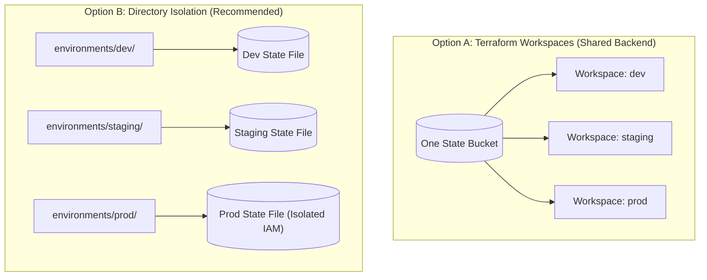

# Multi-Environment Stacks & Blast Radius Management

Cloud Engineering မှာ လုပ်ဆောင်ရတဲ့ architectural ဆုံးဖြတ်ချက်တွေထဲကမှ အရေးကြီးဆုံးတစ်ခုကတော့ **Development, Staging နဲ့ Production environments တွေကို ဘယ်လိုခွဲခြားမလဲ** ဆိုတဲ့ ပြဿနာပဲ ဖြစ်ပါတယ်။



---

## The Great Debate: Workspaces vs. Directory Separation

| Criteria | CLI Workspaces (`terraform workspace`) | Directory Separation (`environments/prod/`) |
| :--- | :--- | :--- |
| **Code Repetition** | Zero (ဖိုင်တွေတူတူပဲ၊ workspace ပဲကွဲတာ) | Minimal (Modules တွေကို ညွှန်းထားတဲ့ root caller ဖိုင်ငယ်လေးတွေပဲ ရှိမယ်) |
| **Blast Radius** | ⚠️ High (environment အားလုံးက backend တစ်ခုတည်းကို ရှယ်သုံးကြတာ) | ✅ Low (State နဲ့ credentials တွေ အကုန်လုံး လုံးဝ သီးသန့်ကွဲနေမယ်) |
| **Credential Separation** | Hard (dev နဲ့ prod မှာ role တစ်ခုတည်းကိုပဲ သုံးရတာ) | Easy (Dev က Dev IAM role သုံးမယ်၊ Prod က Prod IAM role သုံးမယ်) |
| **Industry Standard** | သက်တမ်းတိုပြီး ခဏပဲသုံးမယ့် preview environments တွေအတွက် ကောင်းတယ် | **Dev / Staging / Production တွေအတွက် အကောင်းဆုံး စံနှုန်း (Gold standard)** |

---

## Production Standard: Directory-Based Environment Architecture

ထိပ်တန်း enterprise engineering တွေ သုံးလေ့ရှိတဲ့ directory structure ပုံစံကတော့ ဒီလိုပဲ ဖြစ်ပါတယ်-

```
terraform-infrastructure/
├── modules/                         # Reusable company modules
│   ├── vpc/
│   ├── eks_cluster/
│   └── postgres_rds/
│
└── environments/                   # Isolated environment roots
    ├── dev/
    │   ├── backend.tf              # State key: dev/terraform.tfstate
    │   ├── main.tf                 # Calls modules with small dev sizes
    │   └── terraform.tfvars
    │
    ├── staging/
    │   ├── backend.tf              # State key: staging/terraform.tfstate
    │   ├── main.tf
    │   └── terraform.tfvars
    │
    └── prod/
        ├── backend.tf              # State key: prod/terraform.tfstate (Locked IAM)
        ├── main.tf                 # High availability, Multi-AZ, Read Replicas
        └── terraform.tfvars
```

### Dev Configuration (`environments/dev/main.tf`):
```hcl
provider "aws" {
  region = "us-east-1"
  # Dev AWS Account ID
}

module "app_cluster" {
  source = "../../modules/eks_cluster"

  environment   = "dev"
  node_count    = 2
  instance_type = "t3.medium" # Cheap instances for dev
}
```

### Prod Configuration (`environments/prod/main.tf`):
```hcl
provider "aws" {
  region = "us-east-1"
  # Prod AWS Account ID (Separate Cloud Account!)
}

module "app_cluster" {
  source = "../../modules/eks_cluster"

  environment        = "prod"
  node_count         = 6
  instance_type      = "m5.2xlarge" # High-performance instances
  enable_multi_az    = true
  enable_kms_encrypt = true
}
```

---

## Working with Terraform CLI Workspaces

Feature branch တစ်ခုချင်းစီအတွက် ခေတ္တဖန်တီးထားတဲ့ environments တွေ (ဥပမာ - `feat-auth-preview`) ကို တည်ဆောက်မယ်ဆိုရင် CLI workspaces တွေက အတော်လေး အသုံးဝင်ပါတယ် -

```bash
# 1. ရှိပြီးသား workspaces တွေကို ကြည့်ရန်
$ terraform workspace list
* default

# 2. Workspace အသစ်ဆောက်ပြီး အဲ့ဒီထဲကို ပြောင်းဝင်ရန်
$ terraform workspace new feature-payment-v2
Created and switched to workspace "feature-payment-v2"!

# 3. HCL ထဲမှာ လက်ရှိသုံးနေတဲ့ workspace နံမည်ကို အသုံးပြုပုံ:
```

```hcl
resource "aws_s3_bucket" "preview_bucket" {
  bucket = "app-preview-${terraform.workspace}-2026"
}
```

```bash
# 4. default workspace ဆီကို ပြန်ပြောင်းရန်
terraform workspace select default

# 5. PR merge ပြီးသွားရင် သုံးလက်စ မလိုတော့တဲ့ temporary workspace ကို ဖျက်ရန်
terraform workspace select default
terraform workspace delete feature-payment-v2
```