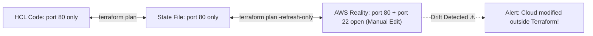

# Drift Detection, State Refresh, and Importing Resources

စံပြကမ္ဘာတစ်ခုမှာဆိုရင် ဘယ်သူမှ Cloud Console ကို သွားမထိကြပါဘူး။ ဒါပေမဲ့ လက်တွေ့ဘဝမှာတော့ on-call engineer တစ်ယောက်က ည ၂ နာရီလောက်မှာ Outage တစ်ခုကို ဖြေရှင်းဖို့အတွက် AWS Console ထဲကနေ Security Group တစ်ခုကို manual ပြင်လိုက်တာမျိုး၊ Instance တစ်ခုကို Upgrade လုပ်လိုက်တာမျိုး လုပ်တတ်ကြပါတယ်။

ဒီလို **desired code**၊ **recorded state** နဲ့ **actual cloud reality** တို့ကြားမှာ မကိုက်ညီဘဲ ဖြစ်နေတာကို **Configuration Drift** လို့ ခေါ်ပါတယ်။



---

## 1. `terraform plan -refresh-only` သုံးပြီး Drift ကို Detect လုပ်ခြင်း

Terraform က Cloud Infrastructure အစစ်တွေကို Safe ဖြစ်ဖြစ်နဲ့ non-destructive ဖြစ်ဖြစ် Scan ဖတ်ပေးနိုင်ပြီး Cloud Resources တွေကို မထိခိုက်စေဘဲ Local State File ကိုပဲ Update လုပ်ပေးနိုင်တဲ့ နည်းလမ်းကို ပေးထားပါတယ် -

```bash
# Query the live AWS API and report any drift
$ terraform plan -refresh-only

Terraform detected the following changes made outside of Terraform:

  # aws_security_group.web has been modified outside Terraform:
  ~ resource "aws_security_group" "web" {
        id   = "sg-0123456789abcdef0"
        name = "production-web-sg"
      ~ ingress = [
          + {
              + cidr_blocks = ["0.0.0.0/0"]
              + from_port   = 22
              + protocol    = "tcp"
              + to_port     = 22
            },
        ]
    }

Note: Objects have changed outside of Terraform. Use "-refresh-only" to update state without modifying real resources.
```

Cloud မှာ ပြောင်းလဲသွားတဲ့ အချက်အလက်တွေကို ကိုယ့်ရဲ့ State File ထဲ လက်ခံထည့်သွင်းချင်တယ်ဆိုရင်တော့ -
```bash
terraform apply -refresh-only
```

---

## 2. ရှိပြီးသား Infrastructure တွေကို Terraform ထဲသို့ Import လုပ်ခြင်း

သင့်ကုမ္ပဏီမှာ Terraform မစတင်ခင် လွန်ခဲ့တဲ့နှစ်တွေကတည်းက Manual ဆောက်ထားခဲ့တဲ့ AWS EC2 Server တွေ ဒါမှမဟုတ် S3 Bucket တွေ ၅၀ လောက် ရှိနေတယ်ဆိုရင် ဘယ်လိုလုပ်မလဲ? အဲ့ဒါတွေကို အစကနေ ထပ်ဆောက်စရာ **မလိုပါဘူး**! အဲ့ဒါတွေကို **Import** လုပ်လို့ရပါတယ်။

### Modern Declarative Import (Terraform 1.5+)

Resources တွေကို Import လုပ်တဲ့ Modern နည်းလမ်းကတော့ HCL ထဲမှာ native `import {}` block ကို သုံးတာပါပဲ:

```hcl
# import.tf
import {
  to = aws_s3_bucket.legacy_data
  id = "company-legacy-customer-data-bucket-2020"
}
```

အခု Terraform ကို HCL Resource block ကို အတိအကျ အလိုအလျောက် Generate လုပ်ခိုင်းလိုက်ပါမယ်:
```bash
terraform plan -generate-config-out=generated_resources.tf
```

ဒါဆိုရင် Terraform က သင့်အတွက် သက်ဆိုင်ရာ `resource "aws_s3_bucket" "legacy_data"` block ကို `generated_resources.tf` ဖိုင်ထဲမှာ ရေးပေးသွားပါလိမ့်မယ်!

Import လုပ်တာကို အဆုံးသတ်ဖို့ Apply Run လိုက်ပါ:
```bash
$ terraform apply

aws_s3_bucket.legacy_data: Importing... [id=company-legacy-customer-data-bucket-2020]
aws_s3_bucket.legacy_data: Import complete [id=company-legacy-customer-data-bucket-2020]

Apply complete! Resources: 1 imported, 0 added, 0 changed, 0 destroyed.
```

---

## 3. Resources တွေကို မဖျက်ဘဲ Code ကို Refactor လုပ်ခြင်း (`moved {}` Blocks)

Terraform ရဲ့ ဗားရှင်းဟောင်းတွေတုန်းကဆိုရင် HCL Code ထဲက Resource နာမည်ကို ပြောင်းလိုက်မယ်ဆိုရင် (ဥပမာ `aws_instance.server` ကနေ `aws_instance.primary_server` လို့ ပြောင်းတာမျိုး) Terraform က **Run နေတဲ့ EC2 Server ကို ဖျက်ပြီး အသစ်ပြန်ဆောက်လိုက်မှာ** ဖြစ်ပါတယ်။

Modern Terraform မှာတော့ `moved {}` block ကိုသုံးပြီး ဒီလိုမဖြစ်အောင် ကာကွယ်နိုင်ပါတယ်:

```hcl
# Refactoring: renamed resource without causing downtime!
moved {
  from = aws_instance.server
  to   = aws_instance.primary_server
}

# Refactoring: moved resource into a module!
moved {
  from = aws_security_group.web_sg
  to   = module.security.aws_security_group.web_sg
}
```

`terraform plan` ကို Run လိုက်တဲ့အခါ Terraform က `moved` block ကို တွေ့ရှိပြီး Internal State Pointer ကိုပဲ အလိုအလျောက် Update လုပ်ပေးသွားပါတယ်။

```bash
$ terraform plan
aws_instance.server has moved to aws_instance.primary_server

Plan: 0 to add, 0 to change, 0 to destroy.
```