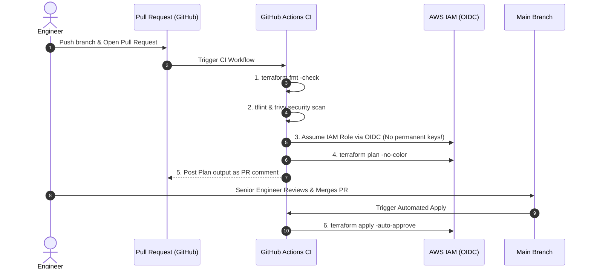

# GitHub Actions ထဲမှာ Automated Terraform CI/CD ပြုလုပ်ခြင်း

Engineer တစ်ယောက်ရဲ့ personal laptop ကနေ `terraform apply` လုပ်တာဟာ အန္တရာယ်များပါတယ်။ ခေတ်မီတဲ့ DevOps workflow တစ်ခုမှာဆိုရင် infrastructure ပြောင်းလဲမှုတွေအားလုံးကို **GitOps CI/CD Pipeline** ကနေတစ်ဆင့် automate လုပ်ကြပါတယ်။



---

## ၁။ OpenID Connect (OIDC) သုံးပြီး AWS Authentication ကို လုံခြုံအောင်လုပ်ခြင်း

permanent ဖြစ်တဲ့ `AWS_ACCESS_KEY_ID` နဲ့ `AWS_SECRET_ACCESS_KEY` တွေ ကို GitHub Secrets မှာ ဘယ်တော့မှ မသိမ်းဆည်းပါနဲ့။ အကယ်၍ ပေါက်ကြားသွားခဲ့ရင် attacker တွေအနေနဲ့ cloud တွေအကုန်လုံးကို အပြည့်အဝ ထိန်းချုပ်သွားနိုင်ပါတယ်။

အဲဒီအစား **GitHub OpenID Connect (OIDC) ကို** သုံးပြီး သက်တမ်းတိုပြီး cryptographically signed ဖြစ်တဲ့ token တစ်ခုနဲ့ ခဏတာသုံးလို့ရမယ့် AWS credentials တွေကို လဲလှယ်သုံးစွဲသင့်ပါတယ်-

```yaml
permissions:
  id-token: write # Required for requesting the JWT token
  contents: read
  pull-requests: write # Required to post plan output back to PR
```

---

## ၂။ Production-ready ဖြစ်တဲ့ Complete GitHub Actions Workflow

`.github/workflows/terraform.yml` ကို အောက်ပါအတိုင်း ဖန်တီးပါ-

```yaml
name: "Terraform Production IaC Pipeline"

on:
  push:
    branches: [ "main" ]
  pull_request:
    branches: [ "main" ]

permissions:
  id-token: write
  contents: read
  pull-requests: write

jobs:
  terraform:
    name: "Terraform Automation"
    runs-on: ubuntu-latest
    defaults:
      run:
        working-directory: ./environments/prod

    steps:
      - name: Checkout Code
        uses: actions/checkout@v4

      - name: Setup Terraform CLI
        uses: hashicorp/setup-terraform@v3
        with:
          terraform_version: 1.8.5

      # Step 1: Format verification
      - name: Terraform Format Check
        id: fmt
        run: terraform fmt -check

      # Step 2: Initialize Backend
      - name: Terraform Init
        id: init
        run: terraform init

      # Step 3: Syntax Validation
      - name: Terraform Validate
        id: validate
        run: terraform validate -no-color

      # Step 4: Speculative Plan on Pull Request
      - name: Terraform Plan
        id: plan
        if: github.event_name == 'pull_request'
        run: |
          terraform plan -no-color -out=tfplan
        continue-on-error: false

      # Step 5: Post formatted Plan summary as PR Comment
      - name: Comment Plan on PR
        uses: actions/github-script@v7
        if: github.event_name == 'pull_request'
        with:
          github-token: ${{ secrets.GITHUB_TOKEN }}
          script: |
            const output = `#### Terraform Format & Style 🖌 \`${{ steps.fmt.outcome }}\`
            #### Terraform Initialization ⚙️ \`${{ steps.init.outcome }}\`
            #### Terraform Validation 🤖 \`${{ steps.validate.outcome }}\`
            #### Terraform Plan 📖 \`${{ steps.plan.outcome }}\`

            *Pushed by: @${{ github.actor }}, Action: \`${{ github.event_name }}\`*`;

            github.rest.issues.createComment({
              issue_number: context.issue.number,
              owner: context.repo.owner,
              repo: context.repo.repo,
              body: output
            })

      # Step 6: Automated Apply on Merge to Main
      - name: Terraform Apply
        if: github.ref == 'refs/heads/main' && github.event_name == 'push'
        run: terraform apply -auto-approve
```

---

## ၃။ Production Best Practices & Guardrails များ

၁။ **Cloud Authentication အတွက် OIDC ကို အမြဲသုံးပါ**: Credentials တွေကို hardcode လုပ်တာမျိုး လုံးဝမလုပ်ပါနဲ့။
၂။ **PR တိုင်းမှာ Speculative Plans လုပ်ပါ**: Code တွေ merge မလုပ်ခင် resource အသစ်ထည့်တာ၊ ဖျက်တာတွေကို အတိအကျ စစ်ဆေးပါ။
၃။ **CI ထဲမှာ Security Scanning ကို automate လုပ်ပါ**: Pipeline ထဲမှာ `trivy config .` (သို့) `tfsec` ကိုသုံးပြီး မလုံခြုံတဲ့ S3 buckets တွေ ဒါမှမဟုတ် ပွင့်နေတဲ့ SSH security groups တွေကို deployment မလုပ်ခင် ရှာဖွေဖယ်ရှားပါ။
၄။ **Main Branch ကို ကာကွယ်ပါ**: Code မ merge ခင် Senior Engineer အနည်းဆုံး ၁ ယောက်ရဲ့ approval နဲ့ CI status checks တွေ အောင်မြင်ဖို့ လိုအပ်အောင် သတ်မှတ်ထားပါ။